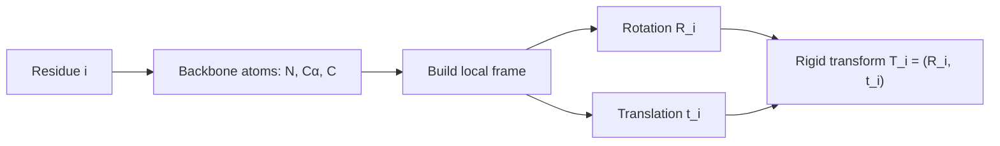
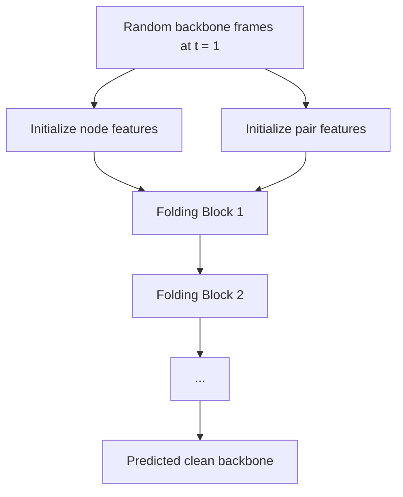

<!--
date: 2026-03-22
description: Read and analyze paper on protein structure generation. Building upon the advancements of AlphaFold2, the 2024 Nobel Prize in Chemistry.
subtitle: Paper about protein structure generation. Building upon the advancements of AlphaFold2, the 2024 Nobel Prize in Chemistry. Accepted in PMLR 2024.
tag: Reading
-->
# Proteus: Exploring Protein Structure Generation for Enhanced Designability and Efficiency
Since this is my first academic paper, I thought it would be easier to start with an article I've already researched and found quite impressive. Besides, I think that because I'll be encountering many international concepts, I'll use English in my academic writing.
{width=70%}
*Paper we read today*
## 1. Protein
### 1.1 What made protein ?
**Amino Acids**

I'll start with this, amino acids. It is the building blocks of proteins (of course there's a lot of concept that smaller than this, but I think this level is enough to understand this paper). 

So what is the amino acids, for those who studied in Vietnam, you may know this concept from high school chemistry, specifically, it is the third or fourth lesson in the chemistry textbook for 12th grade. 

{width=65% position=right}
*The basic structure of amino acids. Cre: [ReAgentChemicals](https://www.reagent.co.uk/blog/what-are-amino-acids/)*

Amino acids are the molecules that contain both an amino group (-NH2) and a carboxyl group (-COOH). In the center of the molecule, there is a carbon atom called the alpha-carbon, which is bonded to the amino group, the carboxyl group, a hydrogen atom, and a side chain (R-group), that are making the different between amino acids.

We have 22 different amino acids, and they are making the different between proteins. Once again, if you are (or were) a Vietnamese student, you may remember the nam GLY, ALA, or VAL, that is the abbreviation of amino acids. 
{width=60%}
*22 types of amino acids. Cre:[JPT](https://www.jpt.com/support-contact/resources/amino-acids/?srsltid=AfmBOop7xZYwPVHzS3WKGWbyR-3O0MFi922hlCleeX-WMBDGccPSVVNQ) *

**Protein**
From the basic concept of amino acids above, we continue to Protein, which basically is the chain of amino acids. 
{width=80% position=right}
*Protein is the chain of amino acids. Cre: [Technologynetwork](https://www.technologynetworks.com/applied-sciences/articles/essential-amino-acids-chart-abbreviations-and-structure-324357)*
Yeah, it is that simple. But the problem is that the protein is not just a straight chain of amino acids. It is a 3D structure that is folded in a specific way. So the next question is, how does the protein fold into a 3D structure?

**Protein Folding**
The protein folding is the process by which a protein folds into its 3D structure. Present into 4 levels:
1. Primary structure: The sequence of amino acids.
2. Secondary structure: The local folding of the protein, such as alpha-helices and beta-sheets.
3. Tertiary structure: The overall 3D structure of the protein.
4. Quaternary structure: The structure of the protein when it is composed of multiple polypeptide chains.
{width=50%}
*Protein folding. Cre: [Linkedin](https://www.linkedin.com/pulse/why-protein-folding-big-deal-balasundararaman-sundar-/)*

### 1.2 CASP 
CASP(Critical Assessment of protein Structure Prediction) is an Sciencetific Internationnal Competition held every 2 years to evaluate methods for predicting the 3D structure of proteins from amino acid sequences.

Teams have to predict the structure of unpublished proteins, then compare it with real experimental results (X-ray, cryo-EM, etc.). 

{width=63% position=right}
*Median Free-Modelling accuracy over years*
This competition is nothing special until 2018 (CASP 13) with the appearance of AplhaFold, the accuracy increase dramatically since this. 2 years later, AlphaFold2 was released in CASP 14 with the highest accuracy in the history, nearly two times higher than the former champion (AlphaFold) with the value of nearly 90%, which is considered as the experimental accuracy. This result is widely remarked that the protein folding problem was largely solved and the later CASP competitions focused on dealing with solving the complex systems instead of a single protein.

{width=60%}
*The dominant metrics of AlphaFold3*

In recent years, CASP 15 with RoseTTAFold and AlphaFold2 updated or CASP 16 with the dominant of AlphaFold3 have increased a lot. But it seems to reach a limit in such a “post-AlphaFold era”. Now scientists are turning to another problem such that "Complex system" above is related to the aspects that AlphaFold not good at.

### 1.3 Some former model and its story
**AlphaFold series and AlphaFold2**

AlphaFold first appear

**RoseTTAFold**
## 2. Computer side
### 2.1 How can we present protein structure in Computer ?
To let a model understand a protein, we first need a representation that is stable under rotation and translation. If we only store the absolute coordinates of all atoms, then two identical proteins placed in two different positions in 3D space would look different to the model. That is inconvenient.

Proteus follows the same general idea as AlphaFold2: each residue is represented by a **rigid frame** attached to its backbone. In practice, this frame is built from the backbone atoms \(N\), \(C_{\alpha}\), and \(C\). So instead of saying "here are only three points in space", we say "here is a local coordinate system for this residue".

Mathematically, one residue can be written as

$$
T_i = (R_i, t_i)
$$

where:

1. \(R_i \in SO(3)\) is the rotation matrix, describing the orientation of residue \(i\).
2. \(t_i \in \mathbb{R}^3\) is the translation vector, describing the position of residue \(i\).

And if a point \(x\) is expressed in the local frame of that residue, then the corresponding global point is

$$
x_{\text{global}} = R_i x + t_i
$$

This is a very nice representation because a rigid transformation preserves distances and angles. In other words, it changes the pose of the residue, but not its internal geometry.

If I explain it in a more intuitive way, each amino acid is given its own little coordinate system. This helps the model reason about local geometry much better than using only raw coordinates. It is also easier to update one residue independently during generation.

### 2.2 Diffusion modeling on protein backbone
The central idea of Proteus is to apply diffusion modeling, but not in the usual image space. Instead of adding noise to pixels, it adds noise to the **translation** and **rotation** of backbone frames.

The general forward process of diffusion can be written as a stochastic differential equation (SDE):

$$
dY_t = f(Y_t, t)\,dt + g(Y_t, t)\,dW_t
$$

where:

1. \(Y_t\) is the random state at time \(t\).
2. \(f(Y_t, t)\) is the drift term, which captures the systematic tendency of the system.
3. \(g(Y_t, t)\,dW_t\) is the diffusion term, which injects randomness.

For normal diffusion models, this often happens in Euclidean space. But for protein backbone generation, the state is no longer only in \(\mathbb{R}^3\). Since each residue has both a position and an orientation, the state lives on

$$
SO(3) \times \mathbb{R}^3
$$

This is one of the most important ideas in the paper. The model must denoise both:

1. where the residue is,
2. and how the residue is rotated.

For the translation part, the noised conditional distribution can be written as

$$
p_{t|0}(x_t \mid x_0) = \mathcal{N}\left(x_t; e^{-t/2}x_0,\,(1-e^{-t})I_3\right)
$$

This equation tells us something very natural: when \(t\) becomes larger, the influence of the original structure \(x_0\) becomes weaker, and the random noise becomes stronger.

From that distribution, the translation score function is

$$
\nabla \log p_{t|0}(x_t \mid x_0) = \frac{e^{-t/2}x_0 - x_t}{1-e^{-t}}
$$

For the rotation part, the paper defines a diffusion process on \(SO(3)\). The exact formula is more complicated because rotation space is not flat like \(\mathbb{R}^3\), but the intuition is similar: early in reverse diffusion, the orientation is very noisy; later, the model gradually recovers the correct backbone orientation.

So the training target of Proteus is essentially: given a noisy backbone frame at some timestep \(t\), predict how to move it back toward the clean protein structure.

### 2.3 Reverse process and feature initialization
At sampling time, Proteus starts from a highly noisy backbone. That means each residue is initialized with random translations and random rotations. Then the model runs the reverse process step by step until a meaningful protein structure appears.

The initialization can be summarized like this:

For the **node representation**, the model uses:

1. the timestep embedding \(t\),
2. the residue identity embedding.

For the **pair representation**, the model uses:

1. embeddings of the two residues,
2. relative sequence position encoding.

This means the model does not only know "which residue is this?", but also "how far are these two residues in the sequence?" That is very useful because many geometric patterns in proteins are strongly related to sequence distance.

The reverse diffusion steps are solved numerically. In the notes, I wrote that the paper uses an Euler-Maruyama style discretization, which is a standard way to simulate and reverse SDE-based processes.

### 2.4 Model architecture
The architecture of Proteus is inspired by AlphaFold2 and RoseTTAFold, but the paper tries to be more efficient and more design-oriented. The whole network is composed of \(L\) folding blocks, and these blocks do **not** share weights.

Each folding block has three main components:

1. IPA-Transformer block
2. Backbone update layer
3. Graph triangle block

#### IPA-Transformer block
This block updates the **single / node representation** of each residue.

The IPA part stands for **Invariant Point Attention**, which was one of the most important ideas from AlphaFold2. The reason it is powerful is that attention is performed in a way that respects 3D geometry. If we rotate or translate the whole protein, the meaningful relationships between residues should stay the same.

So IPA lets the model mix:

1. sequence information,
2. pairwise information,
3. geometric information from the current backbone frames.

In a simpler sentence, IPA helps the model ask: "which residues should pay attention to each other, given both sequence context and current 3D arrangement?"

#### Backbone update layer
After the node features are updated, Proteus updates the backbone itself. This layer predicts how each residue frame should move.

The note I wrote for this part is quite important: the network predicts rotational and translational updates, often parameterized through quaternion-related values and translation vectors, and then converts them into a valid rigid transform.

If a quaternion is written as

$$
q = a + bi + cj + dk
$$

then it must satisfy

$$
a^2 + b^2 + c^2 + d^2 = 1
$$

to represent a valid rotation. After normalization, it can be converted into a rotation matrix and used to update the current residue frame.

So this layer is where the model really says: "based on what I currently understand about this residue, I should rotate it a bit like this, and translate it a bit like that."

#### Graph triangle block
This is probably the most distinctive component of Proteus. The authors even emphasize that this block is a major source of improvement in **designability** and **efficiency**.

The problem they want to solve is that full triangle attention, like the one in AlphaFold2, can be very expensive. A naive version has complexity roughly

$$
O(n^3)
$$

which becomes painful for long proteins.

Proteus replaces that with a graph-based local strategy. For each residue, it looks at only the \(K\) nearest neighbors in 3D space, usually based on distances between \(C_{\alpha}\) atoms. This reduces the effective complexity to approximately

$$
O(NK^2)
$$

which is much more manageable.

There are two ideas here that I found very interesting:

1. **Triangle multiplicative update** is used first to update pair information through triangular relationships.
2. **Structure-aware bias** is injected into attention by using geometric distances, often converted with RBF-like features.

So compared with a purely sequence-based pair module, Proteus puts the current 3D geometry directly into the interaction update. This is very important for backbone generation.

Another way to say it is: if three residues form a meaningful local geometric pattern, then the model should be able to pass information along that triangle. This is exactly the kind of inductive bias that protein structure models need.

### 2.5 A personal interpretation of which block helps which protein level
The paper itself mainly focuses on architecture and empirical performance, not on assigning each block to exactly one biological structure level. But from the notes, I think we can still form a reasonable intuition.

1. **Secondary structure**: the IPA-Transformer and backbone update layers are probably very important here, because they help form local geometric motifs such as \(\alpha\)-helices and \(\beta\)-sheets.
2. **Tertiary structure**: the graph triangle block is especially important, because long- and mid-range geometric consistency is strongly related to how the full 3D fold is organized.
3. **Quaternary structure**: chain positional encoding and local graph interactions help the model distinguish and coordinate multiple polypeptide chains in a complex.

Of course, this is not a strict separation. In reality, all these modules interact with each other during generation.

### 2.6 Training objective
Proteus is trained mainly with **denoising score matching** losses for both translation and rotation. This fits the diffusion viewpoint very well: the model learns a score field that tells it how to denoise a noisy structure.

There are also auxiliary losses, especially when the noise level becomes smaller and the structure starts to look realistic again. In that stage, it makes sense to add stronger geometric constraints, such as:

1. distance matrix loss,
2. coordinate loss on atoms.

This also matches intuition. When the protein is still extremely noisy, asking for precise atom-level agreement is not very meaningful. But when the structure is already partly recovered, these losses become much more useful.

The training data mainly comes from the Protein Data Bank (PDB), together with data augmentation and filtering strategies described in the paper.

### 2.7 Experiments: why Proteus matters
The paper evaluates Proteus against several other backbone generation models, such as Chroma, RFdiffusion, FrameDiff, and Genie.

The main criteria are:

1. **Designability**: can the generated backbone support a sequence that will really fold into it?
2. **Efficiency**: how fast and how cheaply can the model generate samples?
3. **Diversity**: does the model produce a rich set of structures instead of repeating a few familiar shapes?

According to the reported experiments, Proteus performs especially well on **designability**, and this is one of the reasons I found the paper interesting. It is not only about generating a pretty 3D backbone, but about generating a backbone that can actually be used for downstream protein design.

For complexes such as dimers, trimers, or tetramers, the paper also reports strong performance. In other words, the model is not restricted to the easiest single-chain setting.

There are also in-vitro validations in the paper, which is another strong point. In-silico metrics are already useful, but experimental confirmation is much more convincing because it tells us whether the designed proteins can really be expressed and folded in the lab.

## 3. Final thoughts
What I like about Proteus is that it sits in a very interesting place in the post-AlphaFold era.

AlphaFold2 more or less changed the question from "can we predict a structure?" to "what else can we do with structural intelligence?" Proteus is a nice example of this shift. Instead of focusing only on prediction, it moves toward **generation**, **designability**, and **efficiency**.

For me, the most memorable points of the paper are:

1. representing each residue as a rigid frame,
2. running diffusion on \(SO(3) \times \mathbb{R}^3\),
3. using a graph triangle block to keep the model both geometric and efficient.

I think this paper is also a good bridge paper for beginners. It connects ideas from biology, geometry, stochastic processes, and deep learning architecture in a way that is hard at first, but very rewarding once the big picture becomes clear.

If I continue this topic in another post, I would probably write more carefully about three things: the exact definition of the rotational score on \(SO(3)\), the difference between Proteus and RFdiffusion in practice, and why designability is a better target than visual quality alone.
