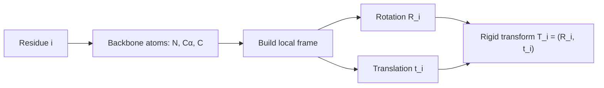
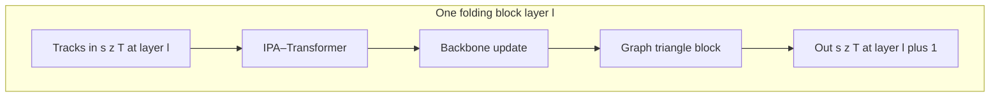

<!--
date: 2026-03-22
description: Read and analyze paper on protein structure generation. Building upon the advancements of AlphaFold2, the 2024 Nobel Prize in Chemistry.
subtitle: Paper about protein structure generation. Building upon the advancements of AlphaFold2, the 2024 Nobel Prize in Chemistry. Accepted in PMLR 2024.
tag: Reading
-->
# Proteus: Exploring Protein Structure Generation for Enhanced Designability and Efficiency
Since this is my first academic paper, I thought it would be easier to start with an article I've already researched and found quite impressive. Besides, I think that because I'll be encountering many international concepts, I'll use English in my academic writing.
{width=70%}
*Paper we read today*
## 1. Protein
### 1.1 What made protein ?
**Amino Acids**

I'll start with this, amino acids. It is the building blocks of proteins (of course there's a lot of concept that smaller than this, but I think this level is enough to understand this paper). 

So what is the amino acids, for those who studied in Vietnam, you may know this concept from high school chemistry, specifically, it is the third or fourth lesson in the chemistry textbook for 12th grade. 

{width=65% position=right}
*The basic structure of amino acids. Cre: [ReAgentChemicals](https://www.reagent.co.uk/blog/what-are-amino-acids/)*

Amino acids are the molecules that contain both an amino group (-NH2) and a carboxyl group (-COOH). In the center of the molecule, there is a carbon atom called the alpha-carbon, which is bonded to the amino group, the carboxyl group, a hydrogen atom, and a side chain (R-group), that are making the different between amino acids.

We have 22 different amino acids, and they are making the different between proteins. Once again, if you are (or were) a Vietnamese student, you may remember the nam GLY, ALA, or VAL, that is the abbreviation of amino acids. 
{width=60%}
*22 types of amino acids. Cre:[JPT](https://www.jpt.com/support-contact/resources/amino-acids/?srsltid=AfmBOop7xZYwPVHzS3WKGWbyR-3O0MFi922hlCleeX-WMBDGccPSVVNQ) *

**Protein**
From the basic concept of amino acids above, we continue to Protein, which basically is the chain of amino acids. 
{width=80% position=right}
*Protein is the chain of amino acids. Cre: [Technologynetwork](https://www.technologynetworks.com/applied-sciences/articles/essential-amino-acids-chart-abbreviations-and-structure-324357)*
Yeah, it is that simple. But the problem is that the protein is not just a straight chain of amino acids. It is a 3D structure that is folded in a specific way. So the next question is, how does the protein fold into a 3D structure?

**Protein Folding**
The protein folding is the process by which a protein folds into its 3D structure. Present into 4 levels:
1. Primary structure: The sequence of amino acids.
2. Secondary structure: The local folding of the protein, such as alpha-helices and beta-sheets.
3. Tertiary structure: The overall 3D structure of the protein.
4. Quaternary structure: The structure of the protein when it is composed of multiple polypeptide chains.
{width=50%}
*Protein folding. Cre: [Linkedin](https://www.linkedin.com/pulse/why-protein-folding-big-deal-balasundararaman-sundar-/)*

### 1.2 CASP 
CASP(Critical Assessment of protein Structure Prediction) is an Sciencetific Internationnal Competition held every 2 years to evaluate methods for predicting the 3D structure of proteins from amino acid sequences.

Teams have to predict the structure of unpublished proteins, then compare it with real experimental results (X-ray, cryo-EM, etc.). 

{width=63% position=right}
*Median Free-Modelling accuracy over years*
This competition is nothing special until 2018 (CASP 13) with the appearance of AplhaFold, the accuracy increase dramatically since this. 2 years later, AlphaFold2 was released in CASP 14 with the highest accuracy in the history, nearly two times higher than the former champion (AlphaFold) with the value of nearly 90%, which is considered as the experimental accuracy. This result is widely remarked that the protein folding problem was largely solved and the later CASP competitions focused on dealing with solving the complex systems instead of a single protein.

{width=60%}
*The dominant metrics of AlphaFold3*

In recent years, CASP 15 with RoseTTAFold and AlphaFold2 updated or CASP 16 with the dominant of AlphaFold3 have increased a lot. But it seems to reach a limit in such a “post-AlphaFold era”. Now scientists are turning to another problem such that "Complex system" above is related to the aspects that AlphaFold not good at.

### 1.3 Some former model and its story
**AlphaFold series and AlphaFold2**

AlphaFold is the turning point of modern protein structure prediction. The first version (CASP13, 2018) showed that deep learning could strongly improve geometric prediction, and AlphaFold2 (CASP14, 2020) pushed performance close to experimental accuracy with end-to-end geometric modeling.

{width=60%}
*AlphaFold2 architecture* 

**AlphaFold first appearance**

At first appearance, AlphaFold mainly predicted geometric constraints (especially pairwise residue distances) and reconstructed 3D from them. It was a major breakthrough, but still pipeline-heavy. AlphaFold2 made the decisive jump by jointly refining sequence, pair, and 3D representations; this is the key reason later generation models (including Proteus) inherit many of its ideas.

**RoseTTAFold**
RoseTTAFold is used because its 3-track design (1D sequence, 2D pair, 3D structure) exchanges information effectively and gives strong structure reasoning.  
{width=60%}
*RoseTTAFold architecture*

The drawback in the Proteus paper context is that triangle-attention-heavy computation is expensive (\(O(N^3)\)) and is less direct in injecting backbone geometry at that stage. Proteus addresses this with local graph neighborhoods (\(O(NK^2)\)) and explicit structure bias.

## 2. Computer side
### 2.1 Protein backbone representation
To let a model understand a protein, we first need a representation that is stable under rotation and translation. If we only store the absolute coordinates of all atoms, then two identical proteins placed in two different positions in 3D space would look different to the model. That is inconvenient.

Rigid frames, as in AlphaFold2. Proteus follows the same idea: the backbone of each residue (each amino acid) is parameterized by a rigid transformation, also called a "frame". Each frame is written as \(T = (R, t)\).

Two notes that matter for the intuition:

1. Rigid means distance-preserving. \(T = (R, t)\) is a rigid transformation: it does not change distances (or angles) within the object being moved—only its position and orientation in space.
2. What the backbone atoms are. Each amino acid has an amino group (N) and a carboxyl group (C), with the alpha-carbon (Cα) sitting between them on the backbone. The local frame is built from these three backbone atoms (N, Cα, C), not from the whole side chain.

**What \(R\) and \(t\) mean in that local picture.**

1. \(R\) (rotation matrix in \(SO(3)\)) encodes 3D rotations. It describes the relative orientation of the residue in its own (local) frame: you can think of it as rotating the axes so the residue is described in a consistent local geometry.
2. \(t\) (translation vector in \(\mathbb{R}^3\)) encodes translation. It describes the relative position of the residue—where the origin of that local frame sits in space (in standard constructions, the origin is tied to the Cα / frame construction rather than using raw atom triples alone as the only description).

**Why not only global \([N, Cα, C]\) coordinates?** A protein has many residues at different absolute positions. Raw 3D coordinates of backbone atoms only give absolute placements; exploiting local geometric relationships across the chain is awkward if every residue is expressed only in a single global coordinate system. So each residue is embedded in its own 3D coordinate system (its frame): \(R\) rotates that system so the residue is represented in a sensible local pose (with Cα playing the role of the frame origin in the usual construction), and \(t\) places that frame in space.

Instead of describing the backbone only by listing atom coordinates in global 3D, the model uses a rigid transform per residue to describe the state of each amino acid. That is convenient when you want to update one residue’s pose independently during generation, instead of having to adjust the entire backbone in an unconstrained way.
{width=60%}
*Backbone representation of a residue*

One residue frame is written as:

$$
T_i = (R_i, t_i)
$$

If a point \(x\) is expressed in the local frame, the corresponding global point is:

$$
x_{\text{global}} = R_i x + t_i
$$

So in one sentence: each amino acid gets its own rigid frame; that makes local geometry and independent per-residue updates much more natural than using only absolute coordinates.

### 2.2 Diffusion modeling on protein backbone
The central idea of Proteus is to use the forward process of a diffusion model, but not to add noise to pixels. The same forward corruption and reverse denoising story applies to the protein backbone: translations and rotations of the frames are noised in diffusion time \(t\), and a network learns to invert that process.

Below: (1) the general forward representation in diffusion modeling—the SDE written explicitly, with each symbol explained; (2) the SDE for the protein backbone, i.e. the same template when the state is on \(SO(3) \times \mathbb{R}^3\) per residue.

{width=60% position=left}
*Diffusion process*

### **(1) General forward representation in diffusion modeling**

A forward diffusion process maps a clean random variable \(Y_0\) to increasingly noisy \(Y_t\) as \(t\) increases. In continuous time, the canonical general forward SDE (Itô form) is:

$$
dY_t = f(Y_t, t)\,dt + g(Y_t, t)\,dW_t.
$$

What each part of this equation means:

1. \(t\) — Diffusion time (algorithmic time), not physical folding time. Larger \(t\) means more forward corruption; typically \(t \in [0, T]\) for some horizon \(T\).
2. \(Y_t\) — The state being noised at time \(t\) (for images: pixels; here: the tuple of all frame rotations and translations). The collection \(\{Y_t\}_{t \ge 0}\) is a stochastic process.
3. \(dY_t\) — The infinitesimal change of \(Y_t\) over an infinitesimal step of diffusion time (Itô calculus).
4. \(f(Y_t, t)\) — The drift coefficient: the deterministic part of the dynamics. If randomness were switched off (\(g \equiv 0\)), you would have \(dY = f(Y,t)\,dt\). Drift encodes systematic motion such as mean reversion or damping.
5. \(dt\) — An infinitesimal time step in diffusion time; it multiplies only the drift in this standard form.
6. \(g(Y_t, t)\) — The diffusion coefficient: how large the random kicks are at state \(Y_t\) and time \(t\) (noise scale / volatility).
7. \(W_t\) — A standard Wiener process (Brownian motion): continuous paths, independent Gaussian increments with mean zero and incremental variance proportional to \(dt\) in the usual formal sense.
8. \(dW_t\) — The Brownian increment on the interval of length \(dt\). The product \(g(Y_t,t)\,dW_t\) is the stochastic term; it injects randomness so trajectories diverge even from identical \(Y_0\).

In one sentence: drift \(f\,dt\) tells you the average, rule-based motion; diffusion \(g\,dW\) adds random spreading. Forward diffusion means choosing \(f\) and \(g\) so that \(Y_t\) becomes easy to sample from at large \(t\).

Simplest discrete forward form. In discrete time, the forward process is often written in one line as a noisy linear update from step \(t-1\) to step \(t\):

$$
x_t = \sqrt{\alpha_t}\, x_{t-1} + \sqrt{1 - \alpha_t}\, \epsilon, \qquad \epsilon \sim \mathcal{N}(0, I).
$$

Here \(x_t\) is the state at step \(t\) (what you noised). Meaning of each piece:

1. \(x_t\) — The state after the \(t\)-th corruption step.
2. \(x_{t-1}\) — The state one step earlier (slightly cleaner).
3. \(\alpha_t\) — A scalar in the noise schedule (usually in \((0,1)\)). It fixes how much of \(x_{t-1}\) is kept versus how much new noise enters at this step.
4. \(\sqrt{\alpha_t}\, x_{t-1}\) — Scales down the previous state. As the schedule is chosen so \(\alpha_t\) tends to shrink over the forward trajectory, this term weakens the signal from \(x_{t-1}\) and pushes the chain toward a simple (often nearly Gaussian) limit.
5. \(\sqrt{1 - \alpha_t}\, \epsilon\) — Fresh Gaussian noise injected at step \(t\); the factor \(\sqrt{1-\alpha_t}\) sets the noise strength at that step.
6. \(\epsilon \sim \mathcal{N}(0, I)\) — Standard normal noise: mean zero, identity covariance, so noise is isotropic across coordinates of \(x\).

Relation to the \(\beta_t\) notation. Many papers instead write the same Markov corruption as

$$
q(Y_t \mid Y_{t-1}) = \mathcal{N}\bigl(Y_t;\, \sqrt{1-\beta_t}\, Y_{t-1},\, \beta_t I\bigr),
$$

i.e. \(Y_t = \sqrt{1-\beta_t}\, Y_{t-1} + \sqrt{\beta_t}\, \varepsilon_t\) with \(\varepsilon_t \sim \mathcal{N}(0,I)\). That is the same update if you identify \(\alpha_t = 1 - \beta_t\) (keep fraction \(\alpha_t\), noise fraction \(1-\alpha_t = \beta_t\)). \(\beta_t\) is then the variance of the new noise at step \(t\). Under standard scalings, long chains of such steps converge to an SDE of the form \(dY_t = f\,dt + g\,dW_t\) above.

### **(2) SDE of the protein backbone**

Let residue \(i\) have rotation \(R_t^{(i)} \in SO(3)\) and translation \(X_t^{(i)} \in \mathbb{R}^3\) in the model's coordinates. The full backbone state is

$$
\mathcal{Y}_t = \bigl\{(R_t^{(i)}, X_t^{(i)})\bigr\}_{i=1}^{N}.
$$

The state space is not a single flat \(\mathbb{R}^d\): each residue lives in \(SO(3) \times \mathbb{R}^3\) (rotation \(\times\) translation), and the chain is the product over residues.

Compact forward SDE (block form, as in the notes). The forward motion on \(SO(3) \times \mathbb{R}^3\) can be written in one stroke for the backbone state at diffusion time \(t\). Let \(\mathbf{T}^{(t)}\) denote that state (rotations and translations stacked for the whole structure). To avoid confusion with section 2.1, \(\mathbf{T}^{(t)}\) here is not a single residue’s rigid map \(T_i=(R_i,t_i)\); it is the time-\(t\) argument of the diffusion. In bracket form:

$$
d\mathbf{T}^{(t)} = \left[ 0,\; -\frac{1}{2}\mathbf{X}^{(t)} \right] dt + \left[ d\mathbf{B}_{SO(3)}^{(t)},\; d\mathbf{B}_{\mathbb{R}^3}^{(t)} \right].
$$

Read this as two coupled blocks (rotation block first, translation block second):

1. \(\mathbf{T}^{(t)}\) — Protein backbone state at diffusion time \(t\).
2. Drift \(\left[ 0,\; -\frac{1}{2}\mathbf{X}^{(t)} \right] dt\):
   - First entry \(0\) — No drift on the rotational part of the forward process.
   - Second entry \(-\frac{1}{2}\mathbf{X}^{(t)}\) — \(\mathbf{X}^{(t)}\) is the position / translation component at time \(t\); the factor \(-\frac{1}{2}\) gives mean reversion toward the origin (the structure is pulled toward a center as diffusion time runs forward, while noise competes with that pull).
3. Noise \(\left[ d\mathbf{B}_{SO(3)}^{(t)},\; d\mathbf{B}_{\mathbb{R}^3}^{(t)} \right]\):
   - \(d\mathbf{B}_{\mathbb{R}^3}^{(t)}\) — Random translational increments in \(\mathbb{R}^3\) (isotropic across three axes).
   - \(d\mathbf{B}_{SO(3)}^{(t)}\) — Random rotational increments intrinsic to \(SO(3)\) (Brownian motion on the rotation group), not Euclidean noise pasted onto rotation matrices.

Backbone SDE in the same general form. Write the forward process on the backbone as

$$
d\mathcal{Y}_t = F(\mathcal{Y}_t, t)\,dt + G(\mathcal{Y}_t, t)\,d\mathbf{W}_t.
$$

Explanation specialized to the backbone:

- \(\mathcal{Y}_t\) — Entire backbone at diffusion time \(t\): all \(\{R_t^{(i)}, X_t^{(i)}\}\).
- \(F(\mathcal{Y}_t,t)\,dt\) — Drift on the product manifold. In the splitting from the notes / Proteus-style forward noising: no extra deterministic drift on the \(SO(3)\) factors (rotation is not systematically steered by a drift term in the forward process); translations carry a mean-reverting drift \(-\tfrac{1}{2} X_t^{(i)}\) so positions are pulled toward the origin and do not wander arbitrarily in \(\mathbb{R}^3\) before noise dominates.
- \(G(\mathcal{Y}_t,t)\,d\mathbf{W}_t\) — Noise, factored into two geometries:
  - \(dW_t^{(i)}\) in \(\mathbb{R}^3\) — standard Brownian motion driving the translational component \(X_t^{(i)}\) (random displacement in 3D).
  - Brownian motion on \(SO(3)\) driving \(R_t^{(i)}\) — random reorientation defined intrinsically on the rotation group (not by adding a matrix of Gaussian noise in \(\mathbb{R}^{3\times 3}\)).

Per-residue equations (explicit drift vs noise). For each residue \(i\),

$$
dX_t^{(i)} = -\frac{1}{2} X_t^{(i)}\, dt + g_{\mathbb{R}^3}(t)\, dW_t^{(i)}, \qquad dW_t^{(i)} \text{ standard BM in } \mathbb{R}^3.
$$

Here \(-\tfrac{1}{2} X_t^{(i)}\,dt\) is the drift on translation (pull toward \(0\)); \(g_{\mathbb{R}^3}(t)\, dW_t^{(i)}\) is translational noise. For the rotation,

$$
dR_t^{(i)} = R_t^{(i)} \circ dB_t^{(i),SO(3)}, \qquad \text{with zero deterministic drift on } SO(3),
$$

schematically: Brownian motion on \(SO(3)\) (noise in the Lie algebra \(\mathfrak{so}(3)\) coupled to \(R_t^{(i)}\)). Thus the protein backbone SDE is the template \(dY = f\,dt + g\,dW\) with \(f\) only on translations (mean reversion) and \(g\,dW\) supplying Euclidean noise for \(X\) and Riemannian noise for \(R\).

Translational marginal and score (\(\mathbb{R}^3\)). Conditioning on a clean \(\mathbf{x}^{(0)}\),

$$
p_{t \mid 0}\bigl(\mathbf{x}^{(t)} \mid \mathbf{x}^{(0)}\bigr) = \mathcal{N}\bigl(\mathbf{x}^{(t)};\, e^{-t/2}\mathbf{x}^{(0)},\, (1-e^{-t})\, I_3 \bigr).
$$

As \(t\) grows, \(\mathbf{x}^{(0)}\) matters less (mean weight \(e^{-t/2}\) decays) and isotropic noise grows in all three axes of \(\mathbb{R}^3\). The score used in denoising (derivative of \(\log p_{t \mid 0}\) w.r.t. the noisy translation) can be written as

$$
\nabla_{\mathbf{x}^{(t)}} \log p_{t \mid 0}\bigl(\mathbf{x}^{(t)} \mid \mathbf{x}^{(0)}\bigr) = (1 - e^{-t})^{-1} \bigl( e^{-t/2}\mathbf{x}^{(0)} - \mathbf{x}^{(t)} \bigr),
$$

equivalently \(\bigl(e^{-t/2}\mathbf{x}^{(0)} - \mathbf{x}^{(t)}\bigr) / (1 - e^{-t})\).

Rotational marginal and score (\(SO(3)\)). Let \(r^{(t)}, r^{(0)} \in SO(3)\) denote noisy and clean rotations. The transition density depends on the relative rotation \(r^{(0)\mathsf{T}} r^{(t)}\) through its rotation angle \(\omega(\cdot)\) (geodesic length on \(SO(3)\)):

$$
p_{t \mid 0}\bigl(r^{(t)} \mid r^{(0)}\bigr) = f\bigl(\omega(r^{(0)\mathsf{T}} r^{(t)}),\, t\bigr).
$$

Here \(f(\omega, t)\) is the heat kernel on \(SO(3)\) (Brownian motion on the group), written as an expansion in Wigner D-matrix / character modes indexed by \(\ell \in \mathbb{N}\):

$$
f(\omega, t) = \sum_{\ell \in \mathbb{N}} (2\ell + 1)\, e^{-\ell(\ell+1)t/2}\, \frac{\sin\bigl((\ell + \tfrac{1}{2})\omega\bigr)}{\sin(\omega/2)}.
$$

The exponent \(-\ell(\ell+1)t/2\) is the familiar angular Laplacian eigenvalue decay on \(SO(3)\); larger \(\ell\) encodes finer angular detail in the kernel. At \(\omega \to 0\), treat the fraction by its limit so the expression stays finite (standard for this kernel). The score on \(SO(3)\) is again the gradient of \(\log p_{t \mid 0}\), but in tangent (Lie algebra) directions on the group, paralleling the translation formula above.

One explicit way to write the rotational score function (matching the notes) is:

$$
\nabla \log p_{t \mid 0}\bigl(r^{(t)} \mid r^{(0)}\bigr)
= \frac{r^{(t)}}{\omega(t)}\, \log\!\bigl(r^{(0)\mathsf{T}} r^{(t)}\bigr)\, \frac{\partial_{\omega} f(\omega(t), t)}{f(\omega(t), t)}.
$$

Here \(\omega(t) := \omega\!\bigl(r^{(0)\mathsf{T}} r^{(t)}\bigr)\) is the rotation angle (geodesic distance), and \(\log(\cdot)\) denotes the matrix log / log map from \(SO(3)\) to its Lie algebra \(\mathfrak{so}(3)\). Conceptually, \(\partial_{\omega} f / f = \partial_{\omega} \log f\) provides the “radial” part of the score along the geodesic, while the \(\log(r^{(0)\mathsf{T}} r^{(t)})\) term provides its direction in the tangent space.

Training and sampling. Exact scores on \(SO(3)\) can be heavy, so training learns an approximate score network \(s_\theta(\mathcal{Y}_t, t)\) via denoising score matching; generation runs a reverse-time discretization (e.g. Euler–Maruyama).

Goal. Recover the clean backbone \(\mathcal{Y}_0\) from any forward time \(t\); same objective as image diffusion, with state space \(\prod_i \bigl(SO(3)\times\mathbb{R}^3\bigr)\) instead of a pixel vector in \(\mathbb{R}^d\). **Notation:** diffusion time stays \(t\) (and \(\mathbf{T}^{(t)}\) above); folding-block depth uses \(\ell\) and backbone frames \(T^\ell\) in §2.3.

### 2.3 Model architecture (Proteus folding block)

**Notation.** In §2.2, \(\mathbf{T}^{(\tau)}\) (or \(\mathcal{Y}_\tau\)) denotes the **whole backbone at diffusion time** \(\tau\). Here, \(T^\ell\) denotes the **backbone frames after folding-block layer** \(\ell\) (one rigid transform per residue, as in §2.1). The single (node) representation is written \(s^\ell\), and the pair / edge representation \(z^\ell\).

Proteus refines structure through **\(L\) folding blocks** stacked in sequence. **Weights are not shared** across blocks: each layer has its own parameters.

Each block takes **three tracks** as input: the **single** (node) representation, the **pair** representation, and the **structural frames** (backbone). It then runs **three modules** in order:

1. **IPA–Transformer block** — updates the **single** representation.
2. **Backbone update** — updates the **frames**.
3. **Graph triangle block** — updates the **pair / edge** representation.

Every module reads the other tracks as context, but each is responsible for one kind of state. The paper stresses that the **graph triangle block** is the main source of gains in **designability and efficiency** (their words: “Our primary emphasis is on elucidating the graph triangle block…”).

{width=85%}
*Figure 2 (Wang et al., 2024): protein backbone diffusion overview (A), stacked folding blocks (B), and the graph triangle block (C).*

#### IPA–Transformer block

This block is the **Invariant Point Attention (IPA)** machinery from **AlphaFold2**, followed by a **standard Transformer** stack (as in the paper).

- **Inputs:** the three representations (single, pair, backbone frames).
- **Output:** an updated **single** representation \(s^{\ell+1}\).

**IPA (intuition).** Protein geometry lives in 3D, and we do not want attention scores to depend on an arbitrary **global** rotation or translation of the whole structure. IPA builds **queries, keys, and values per residue** in a **local** frame, maps them into a **global** frame shared by the protein (defined from the current backbone), lets them interact, then maps back to compute attention weights. That keeps long-range reasoning **consistent** with rigid geometry. A lightweight mental model: IPA runs attention in 3D frame space, **reweights** residue interactions each iteration, and **updates the single channel** while respecting the current backbone layout.

The **Transformer** part is the usual self-attention + feed-forward pattern on the **single** sequence; together, this sub-block’s job is **node-centric** refinement.

#### Backbone update layer

Backbone geometry is **emergent from residue–residue coupling**, so once the **single** representation changes, the model applies an explicit **pose update** to the frames.

- **Inputs:** \(s^{\ell+1}\) (from the IPA–Transformer) and the **previous** frames \(T^\ell\).
- **Outputs:** **Updated** frames \(T^{\ell+1}\).

Mechanistically, a **linear layer** maps the updated residue embedding to coefficients for a **translation** vector and for a **unit quaternion** (three components are predicted; the fourth is fixed so that the quaternion **normalizes** to unit length, i.e. \(a^2 + b^2 + c^2 + d^2 = 1\)). The quaternion is converted to a **rotation matrix** in \(SO(3)\), and that rotation–translation is **composed** with the old frame to obtain the new backbone state (same idea as AlphaFold2’s frame update).

#### Graph triangle block

This module is the **heart of the architecture** for **pair** refinement during **backbone diffusion**. It consumes:

- the **updated** single \(s^{\ell+1}\),
- the **updated** backbone \(T^{\ell+1}\),
- the **previous** edge tensor \(z^\ell\),

and outputs an **updated** edge representation \(z^{\ell+1}\).

**Why not recycle the Evoformer triangle stack as-is?** Triangle attention is the workhorse of AlphaFold2’s **Evoformer**, but two issues show up when you aim it at **diffusion on the backbone**:

1. **Cost:** full triangle attention scales like **\(O(N^3)\)** in the number of residues \(N\).
2. **Structure blind spot:** Evoformer is built around **MSA** and **pair** statistics; it does not feed **current 3D backbone** through those updates the way a diffusion model needs at every step.

The **graph triangle block** addresses both points.

**(A) Local graph, \(O(NK^2)\).** For each residue, the model selects the **\(K\) nearest neighbors in space** (typically by **Cα–Cα** distance). Attention runs on the **\(N \cdot K\)** directed edges carved out of the full \(N^2\) pair grid, so cost grows like **\(O(NK^2)\)** instead of **\(O(N^3)\)**.

**(B) Structure bias from the “third edge”.** For a triangle \((i,j,k)\), the model does **not** always materialize every pair inside the cheap local edge set. It uses **inter-atomic distances along the closing (“third”) edge** of the triangle, passes them through **radial basis functions (RBFs)**—functions whose response **decays with distance**—and injects the result as a **structural bias** into attention logits. A **feedforward gate** (often conditioned on **single** features at the edge endpoints) **scales** that bias and blends it with the other tracks, so geometry does not drown out sequence or pair evidence.

**(C) Triangle multiplicative update first.** Before local triangle attention, Proteus applies a **triangle multiplicative update** in the spirit of **Evoformer**: it propagates **transitive** consistency on the **full** \(N \times N\) pair grid (if \((i,j)\) and \((j,k)\) agree, \((i,k)\) should move in a compatible way). **RFdiffusion** and related work argue this style of update **helps backbone diffusion**, reduces **memory** versus naïve dense attention in some designs, and stays useful across **structure-to-structure** tasks. After that global multiplicative pass, **local triangle attention** refines the **gathered** \(N \cdot K\) edges.

**Internal pipeline (conceptual order).** Triangle multiplicative update (global pair grid) → **neighbour collate** (per-residue \(K\)NN in 3D) → **local pair** features → **distance / RBF bias** featurization → **local pair geometry bias** + **gate** → **attention** (linear projections, dot-product affinities, softmax, edge weights) → **pair update** → **scatter** local updates back into the global edge tensor.

**Triangle attention in one picture.** On the residue graph, **vertices** are residues and **edges** are pair relations. Triangle attention does not score isolated pairs only: for a triangle formed by **three residues**, it routes messages so that **two edges jointly inform the third**—the AlphaFold2 “**outgoing**” and “**incoming**” edge updates. When an edge is **missing** from the active sparse set, **logit bias** along one axis can still carry information from the **other two sides** of the triangle, improving **global** consistency of the pair map.

#### Why this architecture matters (short)

Taken together, the design **drops the worst \(O(N^3)\) wall** of naïve Evoformer-style triangles for large \(N\), **injects current backbone geometry** where naive triangle-only pipelines do not, and—in the authors’ setup—supports training on **longer chains** (they report handling on the order of **1024** residues where **384** was a practical limit for AlphaFold2 / RFdiffusion class models on comparable hardware). Your notes also frame this as easing reliance on **pretrained** pipelines in the RFdiffusion line; the quantitative headline is: **faster, leaner triangle reasoning** that stays **structure-aware** during diffusion.

## 3. Final thoughts
What I like about Proteus is that it sits in a very interesting place in the post-AlphaFold era.

AlphaFold2 more or less changed the question from "can we predict a structure?" to "what else can we do with structural intelligence?" Proteus is a nice example of this shift. Instead of focusing only on prediction, it moves toward **generation**, **designability**, and **efficiency**.

For me, the most memorable points of the paper are:

1. representing each residue as a rigid frame,
2. running diffusion on the combined rotation-and-translation space \(SO(3)\times\mathbb{R}^3\),
3. using a graph triangle block to keep the model both geometric and efficient.

I think this paper is also a good bridge paper for beginners. It connects ideas from biology, geometry, stochastic processes, and deep learning architecture in a way that is hard at first, but very rewarding once the big picture becomes clear.

If I continue this topic in another post, I would probably write more carefully about three things: the exact definition of the rotational score on \(SO(3)\), the difference between Proteus and RFdiffusion in practice, and why designability is a better target than visual quality alone.
