<!--
date: 2026-03-22
description: Read and analyze paper on protein structure generation. Building upon the advancements of AlphaFold2, the 2024 Nobel Prize in Chemistry.
subtitle: Paper about protein structure generation. Building upon the advancements of AlphaFold2, the 2024 Nobel Prize in Chemistry. Accepted in PMLR 2024.
tag: Reading
-->
# Proteus: Exploring Protein Structure Generation for Enhanced Designability and Efficiency
Since this is my first academic paper, I thought it would be easier to start with an article I've already researched and found quite impressive. Besides, I think that because I'll be encountering many international concepts, I'll use English in my academic writing.
{width=70%}
*Paper we read today*
## 1. Protein
### 1.1 What made protein ?
#### Amino acids

I'll start with this, amino acids. It is the building blocks of proteins (of course there's a lot of concept that smaller than this, but I think this level is enough to understand this paper). 

So what is the amino acids, for those who studied in Vietnam, you may know this concept from high school chemistry, specifically, it is the third or fourth lesson in the chemistry textbook for 12th grade. 

{width=65% position=right}
*The basic structure of amino acids. Cre: [ReAgentChemicals](https://www.reagent.co.uk/blog/what-are-amino-acids/)*

Amino acids are the molecules that contain both an amino group (-NH2) and a carboxyl group (-COOH). In the center of the molecule, there is a carbon atom called the alpha-carbon, which is bonded to the amino group, the carboxyl group, a hydrogen atom, and a side chain (R-group), that are making the different between amino acids.

We have 22 different amino acids, and they are making the different between proteins. Once again, if you are (or were) a Vietnamese student, you may remember the nam GLY, ALA, or VAL, that is the abbreviation of amino acids. 
{width=60%}
*22 types of amino acids. Cre:[JPT](https://www.jpt.com/support-contact/resources/amino-acids/?srsltid=AfmBOop7xZYwPVHzS3WKGWbyR-3O0MFi922hlCleeX-WMBDGccPSVVNQ) *

#### Protein
From the basic concept of amino acids above, we continue to Protein, which basically is the chain of amino acids. 
{width=80% position=right}
*Protein is the chain of amino acids. Cre: [Technologynetwork](https://www.technologynetworks.com/applied-sciences/articles/essential-amino-acids-chart-abbreviations-and-structure-324357)*
Yeah, it is that simple. But the problem is that the protein is not just a straight chain of amino acids. It is a 3D structure that is folded in a specific way. So the next question is, how does the protein fold into a 3D structure?

#### Protein folding
The protein folding is the process by which a protein folds into its 3D structure. Present into 4 levels:
1. Primary structure: The sequence of amino acids.
2. Secondary structure: The local folding of the protein, such as alpha-helices and beta-sheets.
3. Tertiary structure: The overall 3D structure of the protein.
4. Quaternary structure: The structure of the protein when it is composed of multiple polypeptide chains.
{width=50%}
*Protein folding. Cre: [Linkedin](https://www.linkedin.com/pulse/why-protein-folding-big-deal-balasundararaman-sundar-/)*

### 1.2 CASP 
CASP(Critical Assessment of protein Structure Prediction) is an Sciencetific Internationnal Competition held every 2 years to evaluate methods for predicting the 3D structure of proteins from amino acid sequences.

Teams have to predict the structure of unpublished proteins, then compare it with real experimental results (X-ray, cryo-EM, etc.). 

{width=63% position=right}
*Median Free-Modelling accuracy over years*
This competition is nothing special until 2018 (CASP 13) with the appearance of AplhaFold, the accuracy increase dramatically since this. 2 years later, AlphaFold2 was released in CASP 14 with the highest accuracy in the history, nearly two times higher than the former champion (AlphaFold) with the value of nearly 90%, which is considered as the experimental accuracy. This result is widely remarked that the protein folding problem was largely solved and the later CASP competitions focused on dealing with solving the complex systems instead of a single protein.

{width=60%}
*The dominant metrics of AlphaFold3*

In recent years, CASP 15 with RoseTTAFold and AlphaFold2 updated or CASP 16 with the dominant of AlphaFold3 have increased a lot. But it seems to reach a limit in such a “post-AlphaFold era”. Now scientists are turning to another problem such that "Complex system" above is related to the aspects that AlphaFold not good at.

### 1.3 Some former model and its story
#### AlphaFold series and AlphaFold2

AlphaFold is the turning point of modern protein structure prediction. The first version (CASP13, 2018) showed that deep learning could strongly improve geometric prediction, and AlphaFold2 (CASP14, 2020) pushed performance close to experimental accuracy with end-to-end geometric modeling.

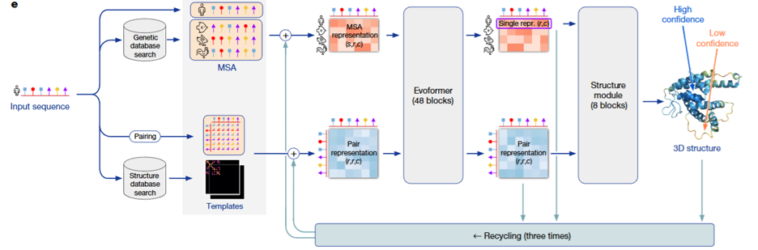{width=60%}
*AlphaFold2 architecture* 

#### AlphaFold first appearance

At first appearance, AlphaFold mainly predicted geometric constraints (especially pairwise residue distances) and reconstructed 3D from them. It was a major breakthrough, but still pipeline-heavy. AlphaFold2 made the decisive jump by jointly refining sequence, pair, and 3D representations; this is the key reason later generation models (including Proteus) inherit many of its ideas.

#### RoseTTAFold
RoseTTAFold is used because its 3-track design (1D sequence, 2D pair, 3D structure) exchanges information effectively and gives strong structure reasoning.  
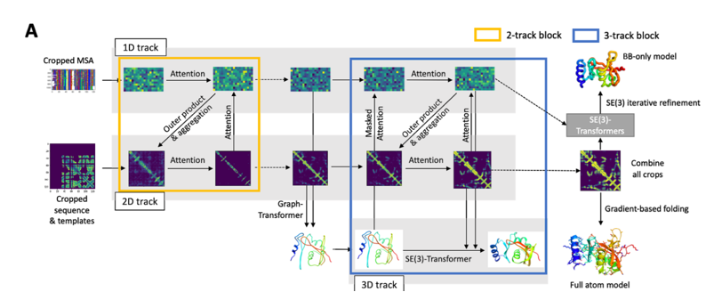{width=60%}
*RoseTTAFold architecture*

The drawback in the Proteus paper context is that triangle-attention-heavy computation is expensive (\(O(N^3)\)) and is less direct in injecting backbone geometry at that stage. Proteus addresses this with local graph neighborhoods (\(O(NK^2)\)) and explicit structure bias.

## 2. Computer side
### 2.1 Protein backbone representation
To let a model understand a protein, we first need a representation that is stable under rotation and translation. If we only store the absolute coordinates of all atoms, then two identical proteins placed in two different positions in 3D space would look different to the model. That is inconvenient.

Rigid frames, as in AlphaFold2. Proteus follows the same idea: the backbone of each residue (each amino acid) is parameterized by a rigid transformation, also called a "frame". Each frame is written as \(T = (R, t)\).

Two notes that matter for the intuition:

1. Rigid means distance-preserving. \(T = (R, t)\) is a rigid transformation: it does not change distances (or angles) within the object being moved—only its position and orientation in space.
2. What the backbone atoms are. Each amino acid has an amino group (N) and a carboxyl group (C), with the alpha-carbon (Cα) sitting between them on the backbone. The local frame is built from these three backbone atoms (N, Cα, C), not from the whole side chain.

#### What \(R\) and \(t\) mean in that local picture

1. \(R\) (rotation matrix in \(SO(3)\)) encodes 3D rotations. It describes the relative orientation of the residue in its own (local) frame: you can think of it as rotating the axes so the residue is described in a consistent local geometry.
2. \(t\) (translation vector in \(\mathbb{R}^3\)) encodes translation. It describes the relative position of the residue—where the origin of that local frame sits in space (in standard constructions, the origin is tied to the Cα / frame construction rather than using raw atom triples alone as the only description).

#### Why not only global \([N, Cα, C]\) coordinates?

A protein has many residues at different absolute positions. Raw 3D coordinates of backbone atoms only give absolute placements; exploiting local geometric relationships across the chain is awkward if every residue is expressed only in a single global coordinate system. So each residue is embedded in its own 3D coordinate system (its frame): \(R\) rotates that system so the residue is represented in a sensible local pose (with Cα playing the role of the frame origin in the usual construction), and \(t\) places that frame in space.

Instead of describing the backbone only by listing atom coordinates in global 3D, the model uses a rigid transform per residue to describe the state of each amino acid. That is convenient when you want to update one residue’s pose independently during generation, instead of having to adjust the entire backbone in an unconstrained way.
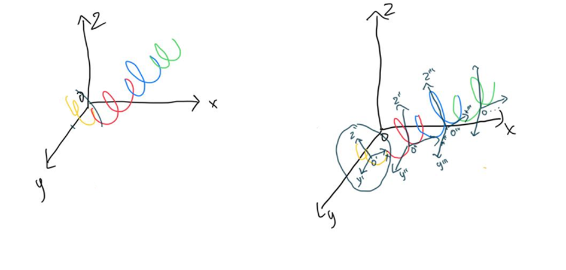{width=60%}
*Backbone representation of a residue*

One residue frame is written as:

$$
T_i = (R_i, t_i)
$$

If a point \(x\) is expressed in the local frame, the corresponding global point is:

$$
x_{\text{global}} = R_i x + t_i
$$

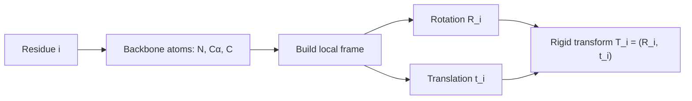

So in one sentence: each amino acid gets its own rigid frame; that makes local geometry and independent per-residue updates much more natural than using only absolute coordinates.

### 2.2 Diffusion modeling on protein backbone
The central idea of Proteus is to use the forward process of a diffusion model, but not to add noise to pixels. The same forward corruption and reverse denoising story applies to the protein backbone: translations and rotations of the frames are noised in diffusion time \(t\), and a network learns to invert that process.

Below: (1) the general forward representation in diffusion modeling—the SDE written explicitly, with each symbol explained; (2) the SDE for the protein backbone, i.e. the same template when the state is on \(SO(3) \times \mathbb{R}^3\) per residue.

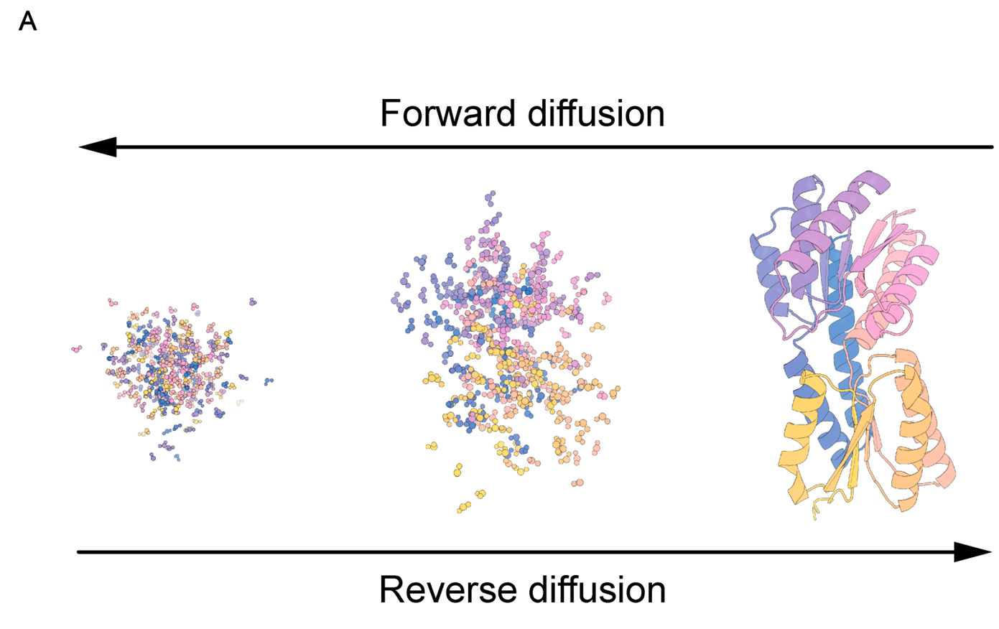{width=80% position=left}
*Diffusion process*

### (1) General forward representation in diffusion modeling

A forward diffusion process maps a clean random variable \(Y_0\) to increasingly noisy \(Y_t\) as \(t\) increases. In continuous time, the canonical general forward SDE (Itô form) is:

$$
dY_t = f(Y_t, t)\,dt + g(Y_t, t)\,dW_t.
$$

What each part of this equation means:

1. \(t\) — Diffusion time (algorithmic time), not physical folding time. Larger \(t\) means more forward corruption; typically \(t \in [0, T]\) for some horizon \(T\).
2. \(Y_t\) — The state being noised at time \(t\) (for images: pixels; here: the tuple of all frame rotations and translations). The collection \(\{Y_t\}_{t \ge 0}\) is a stochastic process.
3. \(dY_t\) — The infinitesimal change of \(Y_t\) over an infinitesimal step of diffusion time (Itô calculus).
4. \(f(Y_t, t)\) — The drift coefficient: the deterministic part of the dynamics. If randomness were switched off (\(g \equiv 0\)), you would have \(dY = f(Y,t)\,dt\). Drift encodes systematic motion such as mean reversion or damping.
5. \(dt\) — An infinitesimal time step in diffusion time; it multiplies only the drift in this standard form.
6. \(g(Y_t, t)\) — The diffusion coefficient: how large the random kicks are at state \(Y_t\) and time \(t\) (noise scale / volatility).
7. \(W_t\) — A standard Wiener process (Brownian motion): continuous paths, independent Gaussian increments with mean zero and incremental variance proportional to \(dt\) in the usual formal sense.
8. \(dW_t\) — The Brownian increment on the interval of length \(dt\). The product \(g(Y_t,t)\,dW_t\) is the stochastic term; it injects randomness so trajectories diverge even from identical \(Y_0\).

In one sentence: drift \(f\,dt\) tells you the average, rule-based motion; diffusion \(g\,dW\) adds random spreading. Forward diffusion means choosing \(f\) and \(g\) so that \(Y_t\) becomes easy to sample from at large \(t\).

Simplest discrete forward form. In discrete time, the forward process is often written in one line as a noisy linear update from step \(t-1\) to step \(t\):

$$
x_t = \sqrt{\alpha_t}\, x_{t-1} + \sqrt{1 - \alpha_t}\, \epsilon, \qquad \epsilon \sim \mathcal{N}(0, I).
$$

Here \(x_t\) is the state at step \(t\) (what you noised). Meaning of each piece:

1. \(x_t\) — The state after the \(t\)-th corruption step.
2. \(x_{t-1}\) — The state one step earlier (slightly cleaner).
3. \(\alpha_t\) — A scalar in the noise schedule (usually in \((0,1)\)). It fixes how much of \(x_{t-1}\) is kept versus how much new noise enters at this step.
4. \(\sqrt{\alpha_t}\, x_{t-1}\) — Scales down the previous state. As the schedule is chosen so \(\alpha_t\) tends to shrink over the forward trajectory, this term weakens the signal from \(x_{t-1}\) and pushes the chain toward a simple (often nearly Gaussian) limit.
5. \(\sqrt{1 - \alpha_t}\, \epsilon\) — Fresh Gaussian noise injected at step \(t\); the factor \(\sqrt{1-\alpha_t}\) sets the noise strength at that step.
6. \(\epsilon \sim \mathcal{N}(0, I)\) — Standard normal noise: mean zero, identity covariance, so noise is isotropic across coordinates of \(x\).

Relation to the \(\beta_t\) notation. Many papers instead write the same Markov corruption as

$$
q(Y_t \mid Y_{t-1}) = \mathcal{N}\bigl(Y_t;\, \sqrt{1-\beta_t}\, Y_{t-1},\, \beta_t I\bigr),
$$

i.e. \(Y_t = \sqrt{1-\beta_t}\, Y_{t-1} + \sqrt{\beta_t}\, \varepsilon_t\) with \(\varepsilon_t \sim \mathcal{N}(0,I)\). That is the same update if you identify \(\alpha_t = 1 - \beta_t\) (keep fraction \(\alpha_t\), noise fraction \(1-\alpha_t = \beta_t\)). \(\beta_t\) is then the variance of the new noise at step \(t\). Under standard scalings, long chains of such steps converge to an SDE of the form \(dY_t = f\,dt + g\,dW_t\) above.

### (2) SDE of the protein backbone

Let residue \(i\) have rotation \(R_t^{(i)} \in SO(3)\) and translation \(X_t^{(i)} \in \mathbb{R}^3\) in the model's coordinates. The full backbone state is

$$
\mathcal{Y}_t = \bigl\{(R_t^{(i)}, X_t^{(i)})\bigr\}_{i=1}^{N}.
$$

The state space is not a single flat \(\mathbb{R}^d\): each residue lives in \(SO(3) \times \mathbb{R}^3\) (rotation \(\times\) translation), and the chain is the product over residues.

Compact forward SDE (block form, as in the notes). The forward motion on \(SO(3) \times \mathbb{R}^3\) can be written in one stroke for the backbone state at diffusion time \(t\). Let \(\mathbf{T}^{(t)}\) denote that state (rotations and translations stacked for the whole structure). To avoid confusion with section 2.1, \(\mathbf{T}^{(t)}\) here is not a single residue’s rigid map \(T_i=(R_i,t_i)\); it is the time-\(t\) argument of the diffusion. In bracket form:

$$
d\mathbf{T}^{(t)} = \left[ 0,\; -\frac{1}{2}\mathbf{X}^{(t)} \right] dt + \left[ d\mathbf{B}_{SO(3)}^{(t)},\; d\mathbf{B}_{\mathbb{R}^3}^{(t)} \right].
$$

Read this as two coupled blocks (rotation block first, translation block second):

1. \(\mathbf{T}^{(t)}\) — Protein backbone state at diffusion time \(t\).
2. Drift \(\left[ 0,\; -\frac{1}{2}\mathbf{X}^{(t)} \right] dt\):
   - First entry \(0\) — No drift on the rotational part of the forward process.
   - Second entry \(-\frac{1}{2}\mathbf{X}^{(t)}\) — \(\mathbf{X}^{(t)}\) is the position / translation component at time \(t\); the factor \(-\frac{1}{2}\) gives mean reversion toward the origin (the structure is pulled toward a center as diffusion time runs forward, while noise competes with that pull).
3. Noise \(\left[ d\mathbf{B}_{SO(3)}^{(t)},\; d\mathbf{B}_{\mathbb{R}^3}^{(t)} \right]\):
   - \(d\mathbf{B}_{\mathbb{R}^3}^{(t)}\) — Random translational increments in \(\mathbb{R}^3\) (isotropic across three axes).
   - \(d\mathbf{B}_{SO(3)}^{(t)}\) — Random rotational increments intrinsic to \(SO(3)\) (Brownian motion on the rotation group), not Euclidean noise pasted onto rotation matrices.

Backbone SDE in the same general form. Write the forward process on the backbone as

$$
d\mathcal{Y}_t = F(\mathcal{Y}_t, t)\,dt + G(\mathcal{Y}_t, t)\,d\mathbf{W}_t.
$$

Explanation specialized to the backbone:

- \(\mathcal{Y}_t\) — Entire backbone at diffusion time \(t\): all \(\{R_t^{(i)}, X_t^{(i)}\}\).
- \(F(\mathcal{Y}_t,t)\,dt\) — Drift on the product manifold. In the splitting from the notes / Proteus-style forward noising: no extra deterministic drift on the \(SO(3)\) factors (rotation is not systematically steered by a drift term in the forward process); translations carry a mean-reverting drift \(-\tfrac{1}{2} X_t^{(i)}\) so positions are pulled toward the origin and do not wander arbitrarily in \(\mathbb{R}^3\) before noise dominates.
- \(G(\mathcal{Y}_t,t)\,d\mathbf{W}_t\) — Noise, factored into two geometries:
  - \(dW_t^{(i)}\) in \(\mathbb{R}^3\) — standard Brownian motion driving the translational component \(X_t^{(i)}\) (random displacement in 3D).
  - Brownian motion on \(SO(3)\) driving \(R_t^{(i)}\) — random reorientation defined intrinsically on the rotation group (not by adding a matrix of Gaussian noise in \(\mathbb{R}^{3\times 3}\)).

Per-residue equations (explicit drift vs noise). For each residue \(i\),

$$
dX_t^{(i)} = -\frac{1}{2} X_t^{(i)}\, dt + g_{\mathbb{R}^3}(t)\, dW_t^{(i)}, \qquad dW_t^{(i)} \text{ standard BM in } \mathbb{R}^3.
$$

Here \(-\tfrac{1}{2} X_t^{(i)}\,dt\) is the drift on translation (pull toward \(0\)); \(g_{\mathbb{R}^3}(t)\, dW_t^{(i)}\) is translational noise. For the rotation,

$$
dR_t^{(i)} = R_t^{(i)} \circ dB_t^{(i),SO(3)}, \qquad \text{with zero deterministic drift on } SO(3),
$$

schematically: Brownian motion on \(SO(3)\) (noise in the Lie algebra \(\mathfrak{so}(3)\) coupled to \(R_t^{(i)}\)). Thus the protein backbone SDE is the template \(dY = f\,dt + g\,dW\) with \(f\) only on translations (mean reversion) and \(g\,dW\) supplying Euclidean noise for \(X\) and Riemannian noise for \(R\).

Translational marginal and score (\(\mathbb{R}^3\)). Conditioning on a clean \(\mathbf{x}^{(0)}\),

$$
p_{t \mid 0}\bigl(\mathbf{x}^{(t)} \mid \mathbf{x}^{(0)}\bigr) = \mathcal{N}\bigl(\mathbf{x}^{(t)};\, e^{-t/2}\mathbf{x}^{(0)},\, (1-e^{-t})\, I_3 \bigr).
$$

As \(t\) grows, \(\mathbf{x}^{(0)}\) matters less (mean weight \(e^{-t/2}\) decays) and isotropic noise grows in all three axes of \(\mathbb{R}^3\). The score used in denoising (derivative of \(\log p_{t \mid 0}\) w.r.t. the noisy translation) can be written as

$$
\nabla_{\mathbf{x}^{(t)}} \log p_{t \mid 0}\bigl(\mathbf{x}^{(t)} \mid \mathbf{x}^{(0)}\bigr) = (1 - e^{-t})^{-1} \bigl( e^{-t/2}\mathbf{x}^{(0)} - \mathbf{x}^{(t)} \bigr),
$$

equivalently \(\bigl(e^{-t/2}\mathbf{x}^{(0)} - \mathbf{x}^{(t)}\bigr) / (1 - e^{-t})\).

Rotational marginal and score (\(SO(3)\)). Let \(r^{(t)}, r^{(0)} \in SO(3)\) denote noisy and clean rotations. The transition density depends on the relative rotation \(r^{(0)\mathsf{T}} r^{(t)}\) through its rotation angle \(\omega(\cdot)\) (geodesic length on \(SO(3)\)):

$$
p_{t \mid 0}\bigl(r^{(t)} \mid r^{(0)}\bigr) = f\bigl(\omega(r^{(0)\mathsf{T}} r^{(t)}),\, t\bigr).
$$

Here \(f(\omega, t)\) is the heat kernel on \(SO(3)\) (Brownian motion on the group), written as an expansion in Wigner D-matrix / character modes indexed by \(\ell \in \mathbb{N}\):

$$
f(\omega, t) = \sum_{\ell \in \mathbb{N}} (2\ell + 1)\, e^{-\ell(\ell+1)t/2}\, \frac{\sin\bigl((\ell + \tfrac{1}{2})\omega\bigr)}{\sin(\omega/2)}.
$$

The exponent \(-\ell(\ell+1)t/2\) is the familiar angular Laplacian eigenvalue decay on \(SO(3)\); larger \(\ell\) encodes finer angular detail in the kernel. At \(\omega \to 0\), treat the fraction by its limit so the expression stays finite (standard for this kernel). The score on \(SO(3)\) is again the gradient of \(\log p_{t \mid 0}\), but in tangent (Lie algebra) directions on the group, paralleling the translation formula above.

One explicit way to write the rotational score function (matching the notes) is:

$$
\nabla \log p_{t \mid 0}\bigl(r^{(t)} \mid r^{(0)}\bigr)
= \frac{r^{(t)}}{\omega(t)}\, \log\!\bigl(r^{(0)\mathsf{T}} r^{(t)}\bigr)\, \frac{\partial_{\omega} f(\omega(t), t)}{f(\omega(t), t)}.
$$

Here \(\omega(t) := \omega\!\bigl(r^{(0)\mathsf{T}} r^{(t)}\bigr)\) is the rotation angle (geodesic distance), and \(\log(\cdot)\) denotes the matrix log / log map from \(SO(3)\) to its Lie algebra \(\mathfrak{so}(3)\). Conceptually, \(\partial_{\omega} f / f = \partial_{\omega} \log f\) provides the “radial” part of the score along the geodesic, while the \(\log(r^{(0)\mathsf{T}} r^{(t)})\) term provides its direction in the tangent space.

Training and sampling. Exact scores on \(SO(3)\) can be heavy, so training learns an approximate score network \(s_\theta(\mathcal{Y}_t, t)\) via denoising score matching; generation runs a reverse-time discretization (e.g. Euler–Maruyama).

Goal. Recover the clean backbone \(\mathcal{Y}_0\) from any forward time \(t\); same objective as image diffusion, with state space \(\prod_i \bigl(SO(3)\times\mathbb{R}^3\bigr)\) instead of a pixel vector in \(\mathbb{R}^d\). Notation: diffusion time stays \(t\) (and \(\mathbf{T}^{(t)}\) above); folding-block depth uses \(\ell\) and backbone frames \(T^\ell\) in §2.3.

### 2.3 Model architecture 

This is the section where I leaned on my own figures the most, not only the paper’s Figure 2. I’ll stay consistent with Section 2.2: there diffusion time is \(t\) and the whole noisy backbone is \(\mathbf{T}^{(t)}\). Here \(\ell\) is the folding-block layer: \(T^\ell\) is the stack of per-residue frames after layer \(\ell\) (same rigid-frame idea as Section 2.1). I write \(s^\ell\) for the single (node) embedding and \(z^\ell\) for the pair / edge tensor.

Yeah, the high-level story is simple. Proteus runs \(L\) folding blocks one after another, and the blocks do not share weights—each has its own parameters.

Inside one block you always have three tracks going in: single, pair, and backbone frames. The block always does the same three steps in order:

1. IPA–Transformer — refreshes \(s\).
2. Backbone update — moves the frames forward.
3. Graph triangle block — refreshes \(z\) (the pair grid).

Every step looks at the other tracks, but only one track is “owned” by that step. The authors say openly that the graph triangle block is what really buys designability and efficiency (“Our primary emphasis is on elucidating the graph triangle block…”).

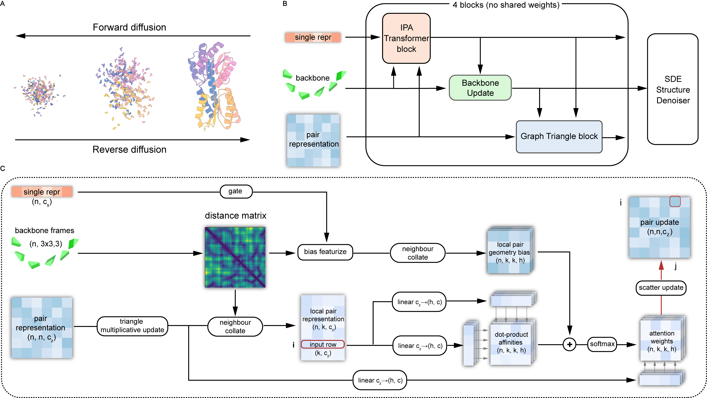{width=85%}
*Figure 2 from the paper: (A) backbone diffusion in/out, (B) stack of folding blocks, (C) zoom on the graph triangle idea.*

**IPA–Transformer block**

Inputs: single representation \(s_\ell\), pair representation \(z_\ell\), current per-residue frames \(T^\ell\), and the initial singles \(s_0\) (for the skip-style path into the Transformer). Outputs: updated singles \(s_{\ell+1}\) only; \(z_\ell\) and \(T^\ell\) are unchanged until the later submodules run.

So this first step is exactly the Invariant Point Attention (IPA) story from AlphaFold2, plus a normal Transformer on top (that is how Wang et al. describe it).

IPA is the part that respects 3D. You don’t want attention logits to change just because you rotate or translate the whole protein in space for no reason. Roughly: each residue builds Q, K, V in its local frame, maps those into a global frame fixed by the current backbone, mixes information, then maps back so the update still “knows” geometry. After that, the Transformer path does the usual self-attention + FFN on the single chain, but with a small twist from the paper: they concatenate the current \(s_\ell\) with a linear projection of the initial \(s_0\) before the Transformer, so the block does not forget where the sequence started.

The block I saved as equations is just the same thing in math form: IPA residual + layer norm, concat with \(s_0\), Transformer + linear residual, then an MLP that outputs \(s_{\ell+1}\).

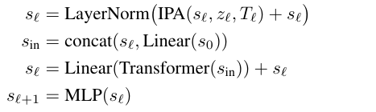{width=75%}
*How I wrote the IPA–Transformer block: IPA on \((s_\ell, z_\ell, T_\ell)\), then concat with \(\mathrm{Linear}(s_0)\), Transformer, and MLP to \(s_{\ell+1}\).*

**Backbone update layer**

Inputs: singles \(s_{\ell+1}\) right after the IPA–Transformer, and the current frames \(T^\ell = \{(R_i^\ell, \mathbf{t}_i^\ell)\}_{i=1}^N\) per residue \(i\). Outputs: updated frames \(T^{\ell+1}\) in the same rigid-frame format; \(s_{\ell+1}\) and \(z_\ell\) are unchanged here.

Once \(s\) has moved, the frames should move too—backbone shape is really about how residues talk to each other, not a separate magic tensor.

What the equations are for. The network must turn a per-residue vector \(s_{\ell+1,i}\) into a small rigid motion that can actually be composed with the current pose: a rotation in \(SO(3)\) and a translation in \(\mathbb{R}^3\). The AlphaFold2-style recipe predicts a raw quaternion tail \((b_i,c_i,d_i)\) with the first component fixed to 1, predicts a translation increment \(\Delta\mathbf{t}_i\), then builds a valid rotation matrix from a normalized quaternion so every update stays a legal Euclidean motion.

Why that form is necessary. (1) Unconstrained \(3\times 3\) matrices from a linear layer are not guaranteed orthogonal or det = +1; quaternion normalization plus the standard quaternion-to-\(SO(3)\) map is a cheap way to guarantee \(R_i^{\mathrm{upd}}\in SO(3)\). (2) Keeping the head at 1 trims one degree of freedom so the downstream map from \(\mathbb{R}^3\) to \(S^3\) is well posed before normalization. (3) Composition \(T_i^{\ell+1} = T_i^{\mathrm{upd}} \circ T_i^\ell\) matches “update the frame in place” during diffusion: you are not solving for the whole chain in one shot—you are applying a learned local rigid transform each time.

How you “solve” them. There is no inner optimization loop here; it is a forward pass of closed-form operations. Write \(\tilde{q}_i = (1, b_i, c_i, d_i)\), \(\hat{q}_i = \tilde{q}_i / \|\tilde{q}_i\|\), convert \(\hat{q}_i\) to \(R_i^{\mathrm{upd}}\) with the usual quaternion–matrix formulas, then compose

$$
R_i^{\ell+1} = R_i^{\mathrm{upd}}\, R_i^\ell,
\qquad
\mathbf{t}_i^{\ell+1} = R_i^{\mathrm{upd}}\, \mathbf{t}_i^\ell + \Delta\mathbf{t}_i
$$

(for the right-multiply convention used in many structure networks; the paper’s slide “equations (1)–(5)” pins down sign/order exactly). Backpropagation differentiates through normalization and the quaternion map automatically—the “solution” at inference is just evaluating this recipe once per block.

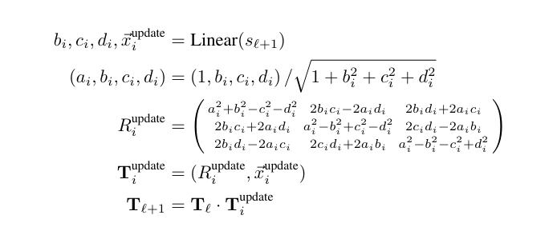{width=40% position=right}
*Backbone update: linear → unit quaternion → rotation matrix → compose with \(T^\ell\) to get \(T^{\ell+1}\).*

**Graph triangle block**

Inputs: singles \(s^{\ell+1}\), updated frames \(T^{\ell+1}\), and the pair tensor \(z^\ell\) entering the block. Outputs: a new pair tensor \(z^{\ell+1}\) that encodes refined \((i,j)\) relationships consistent with the current geometry. This is also where Proteus stops pretending it can paste Evoformer onto diffusion without changes.

::: notes Terminology
- **Single** — per-residue embedding \(s_i\); “what this residue is doing” in latent space.
- **Pair** — embedding \(z_{ij}\) for an ordered residue pair \((i,j)\); the main place triangle reasoning lives.
- **Triangle (multiplicative) update** — AlphaFold2-style message passing on triples \((i,j,k)\) so consistency of \((i,k)\) and \((j,k)\) constrains \((i,j)\).
- **\(K\) nearest neighbors** — keep only the \(K\) closest partners by Cα distance for expensive attention, instead of all \(N-1\) edges.
- **RBF** — radial basis expansion of inter-residue distances, turning a scalar distance into a short feature vector for biasing attention.
- **Logit bias** — add a learned or geometry-derived term to attention scores so likely triangles up-weight compatible third edges.
- **Scatter** — map updates computed on sparse/local edges back into the dense \(N\times N\) pair grid.
- **MSA** — multiple sequence alignment track in Evoformer; Proteus diffusion conditions on the live backbone instead.
:::

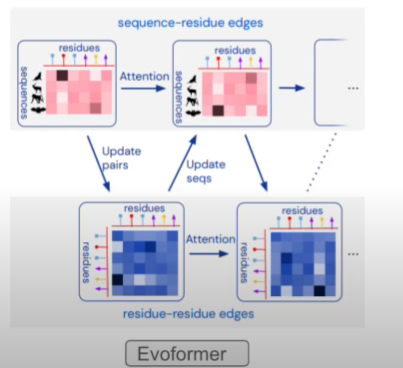{width=50% position=left}
*Evoformer (AlphaFold2): MSA track and pair track talk back and forth; triangle ops live in the pair world.*

**Why Evoformer-as-is is painful here**

(1) Complexity: plain triangle attention is \(O(N^3)\) in the number of residues. (2) Information: Evoformer is built to turn MSA + co-evolution into single and pair features; it is not built to thread the current noisy backbone through every pair update, which is exactly what a backbone diffusion network needs at each step.

Proteus answers with the graph triangle block: keep the triangle multiplication idea on the full \(N\times N\) grid, but do attention only on \(N\cdot K\) local edges (\(K\) nearest neighbors by Cα distance), and bias attention with geometry from the third edge of each triangle (RBF on distances), gated by a small net that reads single features so the bias does not fight the other tracks.

**Module 1: Triangle multiplicative update (full pair grid)**

Inputs: pair tensor \(z^\ell\) (after any entry transform) plus geometry implied by \(T^{\ell+1}\) for indexing triangles. Outputs: an updated dense pair representation—call it \(z_{\mathrm{mult}}\)—where \((i,j)\) has absorbed multiplicative messages along triangles through both outgoing and incoming triangle variants.

If you already studied AlphaFold2, this picture is familiar: one variant uses edges that leave \(i\) and \(j\) and meet at \(k\); the other uses edges that arrive at \(i\) and \(j\) from \(k\). Both are ways to enforce “if \((i,k)\) and \((j,k)\) agree, then \((i,j)\) should not be crazy.” This module is \(O(N^3)\) in the same sense as vanilla triangle multiplication—still heavy—but it does not add another global attention over all edges; later modules sparsify.

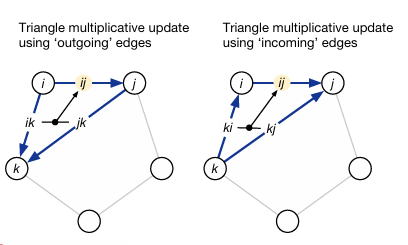{width=82%}
*Triangle multiplicative update: outgoing edges (left) vs incoming edges (right), same \((i,j,k)\) triangle story.*

**Module 2: Neighborhood collation and gated geometry bias**

Inputs: the multiplied pairs \(z_{\mathrm{mult}}\), current frames \(T^{\ell+1}\) for Cα distances, and singles \(s^{\ell+1}\) for gating. Outputs: a sparse set of local pair rows of shape \((n, K, c_z)\) with an accompanying geometry bias tensor shaped like \((n, K, K, h)\) (one head slice \(h\) after projection in the sketch).

For each residue \(i\), collate its top-\(K\) neighbors by Cα distance so attention only scores \((i,j)\) when \(j\) is a candidate partner. In parallel, turn pairwise distances between those neighbors into RBF features, run a light network with a gate that reads \(s^{\ell+1}\), and build a logit bias from the “third edge” of each local triangle. That injects the current 3D backbone into the attention scores without revisiting the full \(O(N^3)\) attention graph.

**Module 3: Local triangle self-attention and scatter-back**

Inputs: local pair features and the bias from Module 2. Outputs: the block’s final \(z^{\ell+1}\) on the full \(N\times N\) grid.

Here triangle self-attention means: attend over edges that share a start node or an end node so two sides of a triangle inform the third. The geometry bias fills in tie-breaking when some pairs are implicit in the sparse view. Weighted values are projected and scattered (summed) back into the dense pair tensor, producing \(z^{\ell+1}\) that the next folding block consumes.

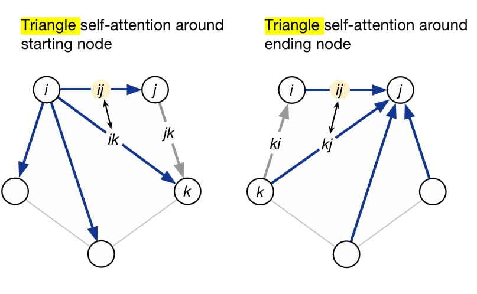{width=82%}
*Triangle self-attention around the starting node vs around the ending node (edges \(ij\) and \(ik\) or \(ij\) and \(kj\)); the grey edge is the “third side.”*

**End-to-end flow I drew for Proteus**

The diagram matches how I think about it: single \((n,c_s)\), backbone frames, pair \((n,n,c_z)\) → distance matrix from frames → triangle multiplicative pass on the full pair grid → neighbour collate down to \((n,k,c_z)\) local pairs → parallel branch: gate on single + bias featurize from distances → local pair geometry bias \((n,k,k,h)\) → dot-product affinities from projected local pairs, add bias, softmax to weights → weight a value projection from the multiplied pairs → scatter back to a full pair update \((n,n,c_z)\).

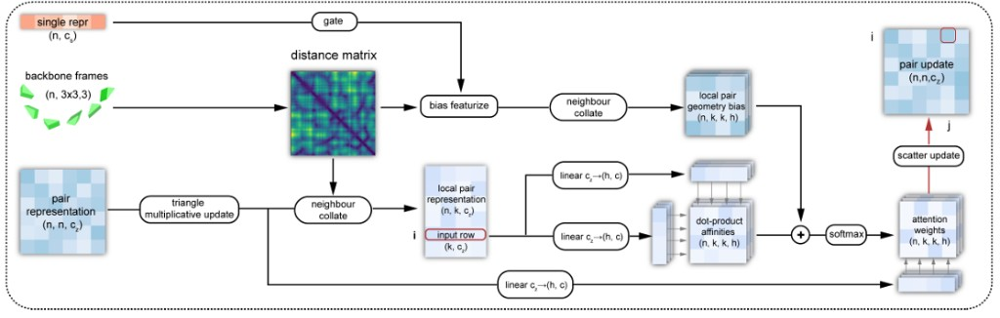{width=92%}
*My graph triangle block sketch: shapes \((n,c_s)\), \((n,n,c_z)\), \(k\) neighbors, \(h\) heads—triangle mult, collate, gated RBF bias, local attention, scatter.*

There is a second layout I exported that is almost the same pipeline; if one is easier to read at small size, use either—they are the same story.

{width=92%}
*Same block, alternate figure layout (bias branch + collate paths).*

**Why I care about this stack**

You dodge the worst \(O(N^3)\) wall for big \(N\) on the attention-heavy part, you keep current 3D inside the pair update (not only MSA statistics), and the paper reports training on longer chains (1024 residues in their setup vs 384-style limits often quoted for AlphaFold2 / RFdiffusion-class training). For me the punchline is still: fast enough to use, geometric enough to design with.

Full paper write-up: Wang et al., *Proteus*, ICML 2024, PMLR 235:51376–51395 — [proceedings page](https://proceedings.mlr.press/v235/wang24bi.html).

### 2.4 Training and evaluation

#### Overall procedure (sampling / inference)

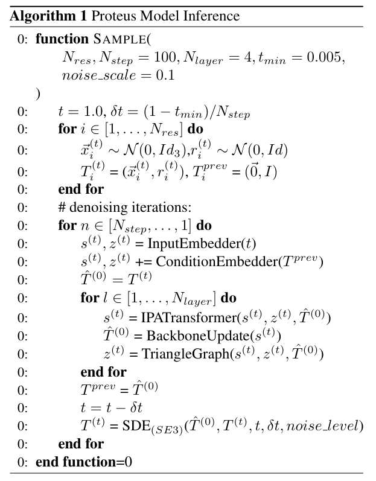{width=48% position=left}

Generation is still a diffusion story, but the noise is geometric: you perturb both where each residue sits and how it is oriented (random translations in \(\mathbb{R}^3\) and random rotations per residue), not raw image pixels. The model is trained end-to-end; at inference you only run the reverse process, discretized with an Euler–Maruyama-style SDE step on the product of \(SE(3)\) factors, using the score parametrization from Section 2.2.

In words that match Algorithm 1 and the same structure as Section 2.3: start at diffusion time \(t = 1\) with a fully noisy backbone—sample a translation and rotation per residue and pack them into rigid transforms \(T_i^{(t)}\), with a “previous structure” cache initialized to identity transforms. Each outer step embeds the timestep into single and pair features (`InputEmbedder`), adds conditioning from the previous predicted backbone (`ConditionEmbedder`), then runs the folding stack for \(N_{\text{layer}}\) blocks: IPA–Transformer on \((s, z, \hat{T}^{(0)})\), backbone update on \(\hat{T}^{(0)}\), then the graph triangle module on \(z\). The network’s current estimate \(\hat{T}^{(0)}\) becomes \(T^{\text{prev}}\) for the next diffusion step; \(t\) is decremented and an \(SE(3)\) SDE solver updates the noisy state \(T^{(t)}\) toward that prediction, with default settings such as \(N_{\text{step}} = 100\), \(N_{\text{layer}} = 4\), \(t_{\min} = 0.005\), and a small noise scale for the discretization.

Feature initialization (the “node / pair init” in my notes) is also where the pipeline connects to sequence: the node embedding concatenates diffusion time \(t\) and a one-hot amino-acid type (fixed to alanine for the unconditional backbone experiment in the notes tied to `D:\proteus\proteus2.pdf`), then passes through an MLP; pair features combine the two endpoint node embeddings with relative sequence-position encodings in the AlphaFold spirit. The PDF walks through the same high-level loop—backbone init, embeddings, repeated folding blocks, and SDE updates—and adds subjective “which block helps which structural level” intuition (IPA + backbone updates leaning on local geometry and secondary-structure-like organization; the graph triangle block injecting long-range geometric consistency; chain positional encoding and local graph modeling for multi-chain complexes). I kept that file as extended commentary; the figure on the left is the paper’s official pseudocode.

#### Data and training objective

Training uses structures from the [Protein Data Bank](https://www.rcsb.org/) with a cutoff of 1 August 2023, plus additional data augmentation. In total the authors report 50,773 protein chains in the training set.

The total objective is the sum of a denoising score-matching block on translations and rotations plus light auxiliary terms on coordinates and the distance matrix, active only once the noise is low enough (\(t < 0.25\)):

$$
\mathcal{L} = \underbrace{\mathcal{L}_{\text{trans}} + 0.5\mathcal{L}_{\text{rot}}}_{\text{dsm loss}} + \underbrace{0.25\mathcal{L}_{\text{coord}}^{t<0.25} + 0.25\mathcal{L}_{\text{dm}}^{t<0.25}}_{\text{auxiliary loss}} \quad (3)
$$

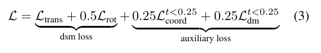{width=88%}

When \(t\) is still large, the backbone is too corrupted for atomic coordinates or pairwise distances to be meaningful supervision; after \(t\) drops below \(0.25\), those terms help lock in fine-grained geometry. Denoising score matching remains the main signal: it pushes the learned score to match the true score of the noised process for both translation and rotation.

#### Benchmarks (designability, speed, diversity)

The paper evaluates monomer generation against RFdiffusion, Genie (SwissProt), FrameDiff, and Chroma. One compact summary table (same metrics as the paper’s main comparison):

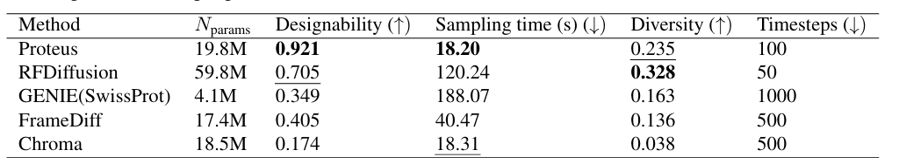{width=45%}

Reading that snapshot in plain language: Proteus reaches the highest designability score (0.921) and the fastest per-sample wall time (18.20 s in the reported setup) while using 100 timesteps; diversity is second-best (0.235) behind RFdiffusion (0.328). RFdiffusion carries the most parameters (59.8M) and is much slower (120.24 s); Genie is smallest (4.1M) but slowest here (188.07 s) and needs many steps (1000); Chroma is almost as fast as Proteus in seconds but lags sharply on designability and diversity; FrameDiff sits in the middle on several axes.

Figure 1 combines several views: a radar chart on designability (sc_TM-score), throughput (samples per minute), and diversity; box plots of scRMSD versus length (200 backbones per length; horizontal reference near 2 Å; ProteinMPNN with 8 sequences per backbone except Chroma’s own designer); and inference time versus length on an A40, with Proteus staying nearly flat while others grow steeply (Genie stops after 600 residues because of memory limits).

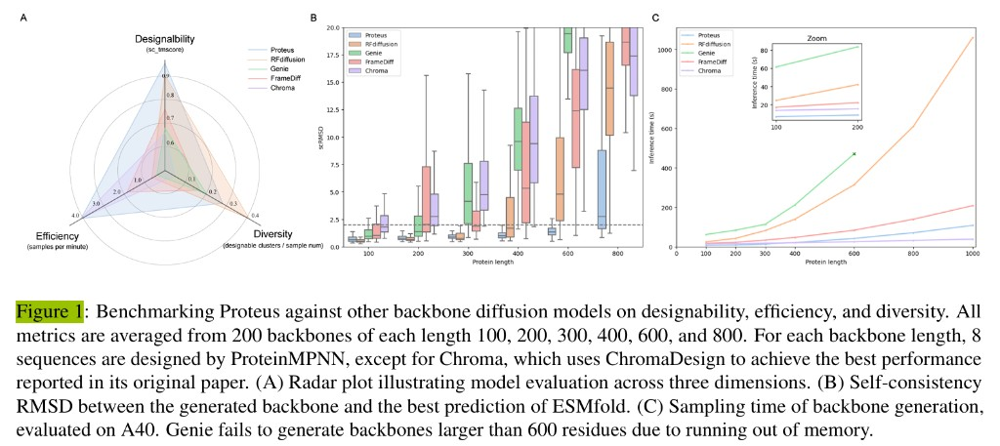{width=92%}

On protein complexes (dimers, trimers, tetramers), Proteus is compared especially to Chroma; the paper reports favorable complex performance there as well.

The authors also describe wet-lab (in vitro) validation: designed proteins from Proteus were expressed and found to fold as intended, complementing the in silico designability numbers.

## 3. Final thoughts
What I like about Proteus is that it sits in a very interesting place in the post-AlphaFold era.

AlphaFold2 more or less changed the question from "can we predict a structure?" to "what else can we do with structural intelligence?" Proteus is a nice example of this shift. Instead of focusing only on prediction, it moves toward generation, designability, and efficiency.

For me, the most memorable points of the paper are:

1. representing each residue as a rigid frame,
2. running diffusion on the combined rotation-and-translation space \(SO(3)\times\mathbb{R}^3\),
3. using a graph triangle block to keep the model both geometric and efficient.

I think this paper is also a good bridge paper for beginners. It connects ideas from biology, geometry, stochastic processes, and deep learning architecture in a way that is hard at first, but very rewarding once the big picture becomes clear.

If I continue this topic in another post, I would probably write more carefully about three things: the exact definition of the rotational score on \(SO(3)\), the difference between Proteus and RFdiffusion in practice, and why designability is a better target than visual quality alone.
