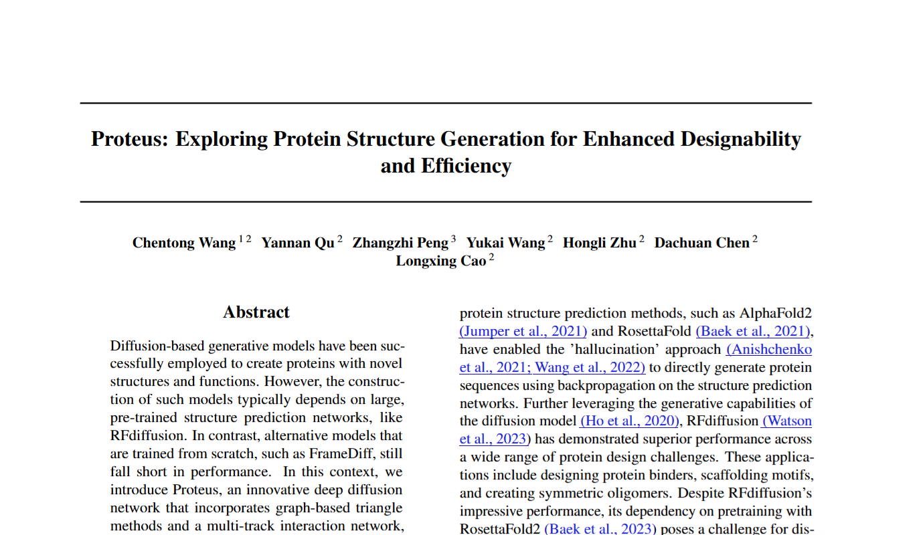
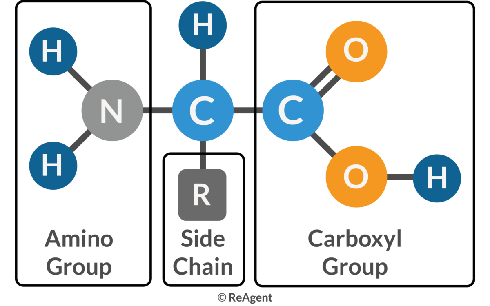
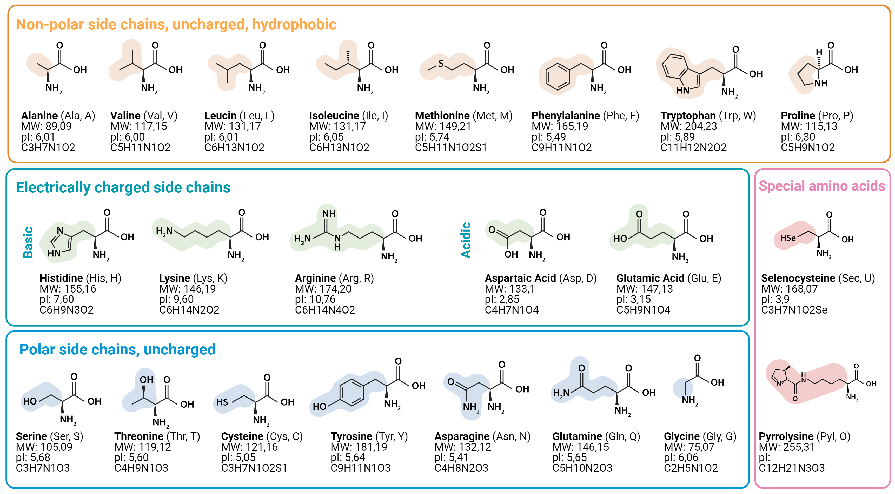
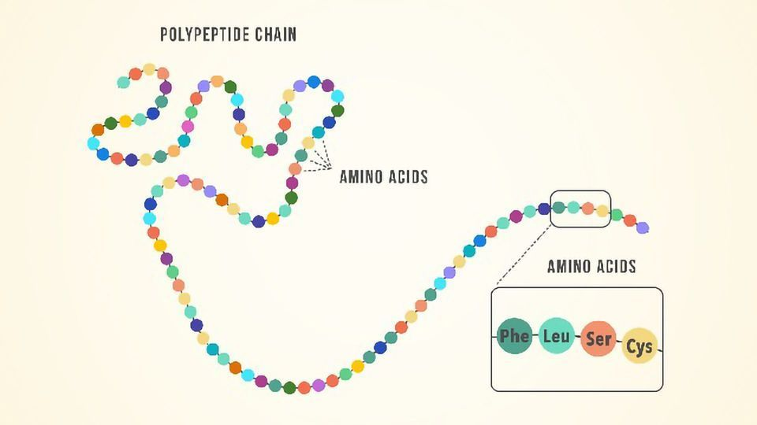
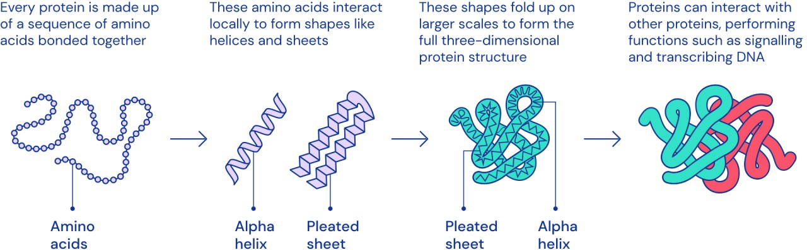
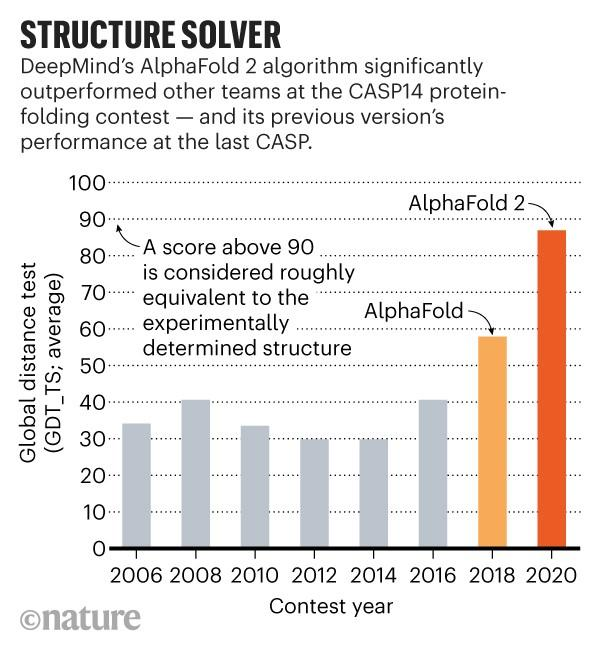
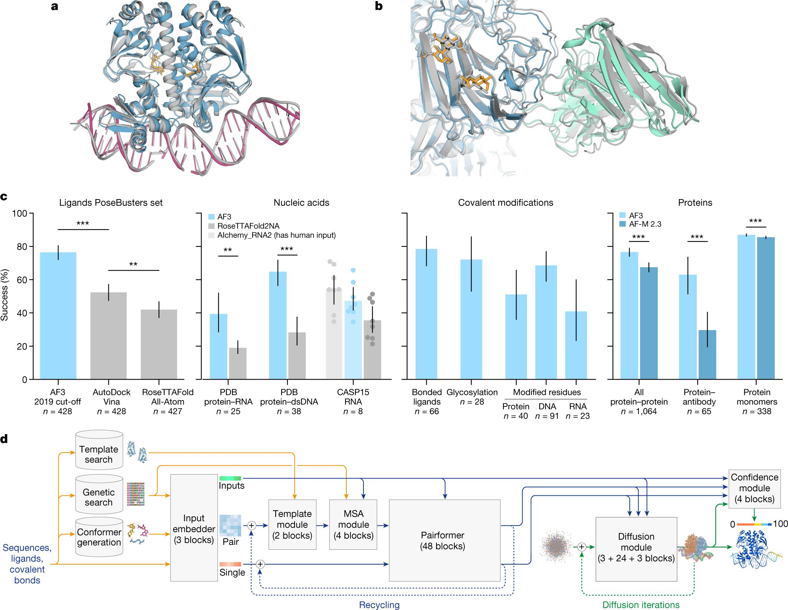
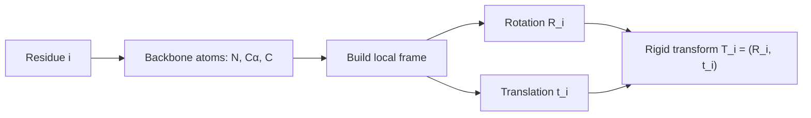

<!--
date: 2026-03-22
description: Read and analyze paper on protein structure generation. Building upon the advancements of AlphaFold2, the 2024 Nobel Prize in Chemistry.
subtitle: Paper about protein structure generation. Building upon the advancements of AlphaFold2, the 2024 Nobel Prize in Chemistry. Accepted in PMLR 2024.
tag: Reading
-->
# Proteus: Exploring Protein Structure Generation for Enhanced Designability and Efficiency
Since this is my first academic paper, I thought it would be easier to start with an article I've already researched and found quite impressive. Besides, I think that because I'll be encountering many international concepts, I'll use English in my academic writing.
{width=70%}
*Paper we read today*
## 1. Protein
### 1.1 What made protein ?
**Amino Acids**

I'll start with this, amino acids. It is the building blocks of proteins (of course there's a lot of concept that smaller than this, but I think this level is enough to understand this paper). 

So what is the amino acids, for those who studied in Vietnam, you may know this concept from high school chemistry, specifically, it is the third or fourth lesson in the chemistry textbook for 12th grade. 

{width=65% position=right}
*The basic structure of amino acids. Cre: [ReAgentChemicals](https://www.reagent.co.uk/blog/what-are-amino-acids/)*

Amino acids are the molecules that contain both an amino group (-NH2) and a carboxyl group (-COOH). In the center of the molecule, there is a carbon atom called the alpha-carbon, which is bonded to the amino group, the carboxyl group, a hydrogen atom, and a side chain (R-group), that are making the different between amino acids.

We have 22 different amino acids, and they are making the different between proteins. Once again, if you are (or were) a Vietnamese student, you may remember the nam GLY, ALA, or VAL, that is the abbreviation of amino acids. 
{width=60%}
*22 types of amino acids. Cre:[JPT](https://www.jpt.com/support-contact/resources/amino-acids/?srsltid=AfmBOop7xZYwPVHzS3WKGWbyR-3O0MFi922hlCleeX-WMBDGccPSVVNQ) *

**Protein**
From the basic concept of amino acids above, we continue to Protein, which basically is the chain of amino acids. 
{width=80% position=right}
*Protein is the chain of amino acids. Cre: [Technologynetwork](https://www.technologynetworks.com/applied-sciences/articles/essential-amino-acids-chart-abbreviations-and-structure-324357)*
Yeah, it is that simple. But the problem is that the protein is not just a straight chain of amino acids. It is a 3D structure that is folded in a specific way. So the next question is, how does the protein fold into a 3D structure?

**Protein Folding**
The protein folding is the process by which a protein folds into its 3D structure. Present into 4 levels:
1. Primary structure: The sequence of amino acids.
2. Secondary structure: The local folding of the protein, such as alpha-helices and beta-sheets.
3. Tertiary structure: The overall 3D structure of the protein.
4. Quaternary structure: The structure of the protein when it is composed of multiple polypeptide chains.
{width=50%}
*Protein folding. Cre: [Linkedin](https://www.linkedin.com/pulse/why-protein-folding-big-deal-balasundararaman-sundar-/)*

### 1.2 CASP 
CASP(Critical Assessment of protein Structure Prediction) is an Sciencetific Internationnal Competition held every 2 years to evaluate methods for predicting the 3D structure of proteins from amino acid sequences.

Teams have to predict the structure of unpublished proteins, then compare it with real experimental results (X-ray, cryo-EM, etc.). 

{width=63% position=right}
*Median Free-Modelling accuracy over years*
This competition is nothing special until 2018 (CASP 13) with the appearance of AplhaFold, the accuracy increase dramatically since this. 2 years later, AlphaFold2 was released in CASP 14 with the highest accuracy in the history, nearly two times higher than the former champion (AlphaFold) with the value of nearly 90%, which is considered as the experimental accuracy. This result is widely remarked that the protein folding problem was largely solved and the later CASP competitions focused on dealing with solving the complex systems instead of a single protein.

{width=60%}
*The dominant metrics of AlphaFold3*

In recent years, CASP 15 with RoseTTAFold and AlphaFold2 updated or CASP 16 with the dominant of AlphaFold3 have increased a lot. But it seems to reach a limit in such a “post-AlphaFold era”. Now scientists are turning to another problem such that "Complex system" above is related to the aspects that AlphaFold not good at.

### 1.3 Some former model and its story
**AlphaFold series and AlphaFold2**

AlphaFold is the turning point of modern protein structure prediction. The first version (CASP13, 2018) showed that deep learning could strongly improve geometric prediction, and AlphaFold2 (CASP14, 2020) pushed performance close to experimental accuracy with end-to-end geometric modeling.

**AlphaFold first appearance**

At first appearance, AlphaFold mainly predicted geometric constraints (especially pairwise residue distances) and reconstructed 3D from them. It was a major breakthrough, but still pipeline-heavy. AlphaFold2 made the decisive jump by jointly refining sequence, pair, and 3D representations; this is the key reason later generation models (including Proteus) inherit many of its ideas.

**RoseTTAFold**
RoseTTAFold is used because its 3-track design (1D sequence, 2D pair, 3D structure) exchanges information effectively and gives strong structure reasoning.  
The drawback in the Proteus paper context is that triangle-attention-heavy computation is expensive (\(O(N^3)\)) and is less direct in injecting backbone geometry at that stage. Proteus addresses this with local graph neighborhoods (\(O(NK^2)\)) and explicit structure bias.
## 2. Computer side
### 2.1 Protein backbone representation
To let a model understand a protein, we first need a representation that is stable under rotation and translation. If we only store the absolute coordinates of all atoms, then two identical proteins placed in two different positions in 3D space would look different to the model. That is inconvenient.

**Rigid frames, as in AlphaFold2.** Proteus follows the same idea: the backbone of each residue (each amino acid) is parameterized by a **rigid transformation**, also called a **frame**. Each frame is written as \(T = (R, t)\).

Two notes that matter for the intuition:

1. **Rigid means distance-preserving.** \(T = (R, t)\) is a rigid transformation: it does not change distances (or angles) within the object being moved—only its position and orientation in space.
2. **What the backbone atoms are.** Each amino acid has an amino group (N) and a carboxyl group (C), with the **alpha-carbon (Cα)** sitting between them on the backbone. The local frame is built from these three backbone atoms (N, Cα, C), not from the whole side chain.

**What \(R\) and \(t\) mean in that local picture.**

1. **\(R\) (rotation matrix in \(SO(3)\))** encodes 3D rotations. It describes the **relative orientation** of the residue in its own (local) frame: you can think of it as rotating the axes so the residue is described in a consistent local geometry.
2. **\(t\) (translation vector in \(\mathbb{R}^3\))** encodes translation. It describes the **relative position** of the residue—where the origin of that local frame sits in space (in standard constructions, the origin is tied to the Cα / frame construction rather than using raw atom triples alone as the only description).

**Why not only global \([N, Cα, C]\) coordinates?** A protein has many residues at different absolute positions. Raw 3D coordinates of backbone atoms only give **absolute** placements; exploiting **local** geometric relationships across the chain is awkward if every residue is expressed only in a single global coordinate system. So **each residue is embedded in its own 3D coordinate system** (its frame): \(R\) rotates that system so the residue is represented in a sensible local pose (with Cα playing the role of the frame origin in the usual construction), and \(t\) places that frame in space.

Instead of describing the backbone **only** by listing atom coordinates in global 3D, the model uses a **rigid transform per residue** to describe the state of each amino acid. That is convenient when you want to **update one residue’s pose independently** during generation, instead of having to adjust the entire backbone in an unconstrained way.

One residue frame is written as:

$$
T_i = (R_i, t_i)
$$

If a point \(x\) is expressed in the local frame, the corresponding global point is:

$$
x_{\text{global}} = R_i x + t_i
$$

So in one sentence: each amino acid gets its own rigid frame; that makes local geometry and independent per-residue updates much more natural than using only absolute coordinates.

### 2.2 Diffusion modeling on protein backbone
The central idea of Proteus is to use the forward process of a diffusion model, but not to add noise to pixels. The same forward corruption and reverse denoising story applies to the protein backbone: translations and rotations of the frames are noised in diffusion time \(t\), and a network learns to invert that process.

Below: (1) the general forward representation in diffusion modeling—the SDE written explicitly, with each symbol explained; (2) the SDE for the protein backbone, i.e. the same template when the state is on \(SO(3) \times \mathbb{R}^3\) per residue.

### **(1) General forward representation in diffusion modeling**

A forward diffusion process maps a clean random variable \(Y_0\) to increasingly noisy \(Y_t\) as \(t\) increases. In continuous time, the canonical general forward SDE (Itô form) is:

$$
dY_t = f(Y_t, t)\,dt + g(Y_t, t)\,dW_t.
$$

What each part of this equation means:

1. \(t\) — Diffusion time (algorithmic time), not physical folding time. Larger \(t\) means more forward corruption; typically \(t \in [0, T]\) for some horizon \(T\).
2. \(Y_t\) — The state being noised at time \(t\) (for images: pixels; here: the tuple of all frame rotations and translations). The collection \(\{Y_t\}_{t \ge 0}\) is a stochastic process.
3. \(dY_t\) — The infinitesimal change of \(Y_t\) over an infinitesimal step of diffusion time (Itô calculus).
4. \(f(Y_t, t)\) — The drift coefficient: the deterministic part of the dynamics. If randomness were switched off (\(g \equiv 0\)), you would have \(dY = f(Y,t)\,dt\). Drift encodes systematic motion such as mean reversion or damping.
5. \(dt\) — An infinitesimal time step in diffusion time; it multiplies only the drift in this standard form.
6. \(g(Y_t, t)\) — The diffusion coefficient: how large the random kicks are at state \(Y_t\) and time \(t\) (noise scale / volatility).
7. \(W_t\) — A standard Wiener process (Brownian motion): continuous paths, independent Gaussian increments with mean zero and incremental variance proportional to \(dt\) in the usual formal sense.
8. \(dW_t\) — The Brownian increment on the interval of length \(dt\). The product \(g(Y_t,t)\,dW_t\) is the stochastic term; it injects randomness so trajectories diverge even from identical \(Y_0\).

In one sentence: drift \(f\,dt\) tells you the average, rule-based motion; diffusion \(g\,dW\) adds random spreading. Forward diffusion means choosing \(f\) and \(g\) so that \(Y_t\) becomes easy to sample from at large \(t\).

Simplest discrete forward form. In discrete time, the forward process is often written in one line as a noisy linear update from step \(t-1\) to step \(t\):

$$
x_t = \sqrt{\alpha_t}\, x_{t-1} + \sqrt{1 - \alpha_t}\, \epsilon, \qquad \epsilon \sim \mathcal{N}(0, I).
$$

Here \(x_t\) is the state at step \(t\) (what you noised). Meaning of each piece:

1. \(x_t\) — The state after the \(t\)-th corruption step.
2. \(x_{t-1}\) — The state one step earlier (slightly cleaner).
3. \(\alpha_t\) — A scalar in the noise schedule (usually in \((0,1)\)). It fixes how much of \(x_{t-1}\) is kept versus how much new noise enters at this step.
4. \(\sqrt{\alpha_t}\, x_{t-1}\) — Scales down the previous state. As the schedule is chosen so \(\alpha_t\) tends to shrink over the forward trajectory, this term weakens the signal from \(x_{t-1}\) and pushes the chain toward a simple (often nearly Gaussian) limit.
5. \(\sqrt{1 - \alpha_t}\, \epsilon\) — Fresh Gaussian noise injected at step \(t\); the factor \(\sqrt{1-\alpha_t}\) sets the noise strength at that step.
6. \(\epsilon \sim \mathcal{N}(0, I)\) — Standard normal noise: mean zero, identity covariance, so noise is isotropic across coordinates of \(x\).

Relation to the \(\beta_t\) notation. Many papers instead write the same Markov corruption as

$$
q(Y_t \mid Y_{t-1}) = \mathcal{N}\bigl(Y_t;\, \sqrt{1-\beta_t}\, Y_{t-1},\, \beta_t I\bigr),
$$

i.e. \(Y_t = \sqrt{1-\beta_t}\, Y_{t-1} + \sqrt{\beta_t}\, \varepsilon_t\) with \(\varepsilon_t \sim \mathcal{N}(0,I)\). That is the same update if you identify \(\alpha_t = 1 - \beta_t\) (keep fraction \(\alpha_t\), noise fraction \(1-\alpha_t = \beta_t\)). \(\beta_t\) is then the variance of the new noise at step \(t\). Under standard scalings, long chains of such steps converge to an SDE of the form \(dY_t = f\,dt + g\,dW_t\) above.

### **(2) SDE of the protein backbone**

Let residue \(i\) have rotation \(R_t^{(i)} \in SO(3)\) and translation \(X_t^{(i)} \in \mathbb{R}^3\) in the model's coordinates. The full backbone state is

$$
\mathcal{Y}_t = \bigl\{(R_t^{(i)}, X_t^{(i)})\bigr\}_{i=1}^{N}.
$$

The state space is not a single flat \(\mathbb{R}^d\): each residue lives in \(SO(3) \times \mathbb{R}^3\) (rotation \(\times\) translation), and the chain is the product over residues.

Compact forward SDE (block form, as in the notes). The forward motion on \(SO(3) \times \mathbb{R}^3\) can be written in one stroke for the backbone state at diffusion time \(t\). Let \(\mathbf{T}^{(t)}\) denote that state (rotations and translations stacked for the whole structure). To avoid confusion with §2.1, \(\mathbf{T}^{(t)}\) here is not a single residue’s rigid map \(T_i=(R_i,t_i)\); it is the time-\(t\) argument of the diffusion. In bracket form:

$$
d\mathbf{T}^{(t)} = \left[ 0,\; -\frac{1}{2}\mathbf{X}^{(t)} \right] dt + \left[ d\mathbf{B}_{SO(3)}^{(t)},\; d\mathbf{B}_{\mathbb{R}^3}^{(t)} \right].
$$

Read this as two coupled blocks (rotation block first, translation block second):

1. \(\mathbf{T}^{(t)}\) — Protein backbone state at diffusion time \(t\).
2. Drift \(\left[ 0,\; -\frac{1}{2}\mathbf{X}^{(t)} \right] dt\):
   - First entry \(0\) — No drift on the rotational part of the forward process.
   - Second entry \(-\frac{1}{2}\mathbf{X}^{(t)}\) — \(\mathbf{X}^{(t)}\) is the position / translation component at time \(t\); the factor \(-\frac{1}{2}\) gives mean reversion toward the origin (the structure is pulled toward a center as diffusion time runs forward, while noise competes with that pull).
3. Noise \(\left[ d\mathbf{B}_{SO(3)}^{(t)},\; d\mathbf{B}_{\mathbb{R}^3}^{(t)} \right]\):
   - \(d\mathbf{B}_{\mathbb{R}^3}^{(t)}\) — Random translational increments in \(\mathbb{R}^3\) (isotropic across three axes).
   - \(d\mathbf{B}_{SO(3)}^{(t)}\) — Random rotational increments intrinsic to \(SO(3)\) (Brownian motion on the rotation group), not Euclidean noise pasted onto rotation matrices.

Backbone SDE in the same general form. Write the forward process on the backbone as

$$
d\mathcal{Y}_t = F(\mathcal{Y}_t, t)\,dt + G(\mathcal{Y}_t, t)\,d\mathbf{W}_t.
$$

Explanation specialized to the backbone:

- \(\mathcal{Y}_t\) — Entire backbone at diffusion time \(t\): all \(\{R_t^{(i)}, X_t^{(i)}\}\).
- \(F(\mathcal{Y}_t,t)\,dt\) — Drift on the product manifold. In the splitting from the notes / Proteus-style forward noising: no extra deterministic drift on the \(SO(3)\) factors (rotation is not systematically steered by a drift term in the forward process); translations carry a mean-reverting drift \(-\tfrac{1}{2} X_t^{(i)}\) so positions are pulled toward the origin and do not wander arbitrarily in \(\mathbb{R}^3\) before noise dominates.
- \(G(\mathcal{Y}_t,t)\,d\mathbf{W}_t\) — Noise, factored into two geometries:
  - \(dW_t^{(i)}\) in \(\mathbb{R}^3\) — standard Brownian motion driving the translational component \(X_t^{(i)}\) (random displacement in 3D).
  - Brownian motion on \(SO(3)\) driving \(R_t^{(i)}\) — random reorientation defined intrinsically on the rotation group (not by adding a matrix of Gaussian noise in \(\mathbb{R}^{3\times 3}\)).

Per-residue equations (explicit drift vs noise). For each residue \(i\),

$$
dX_t^{(i)} = -\frac{1}{2} X_t^{(i)}\, dt + g_{\mathbb{R}^3}(t)\, dW_t^{(i)}, \qquad dW_t^{(i)} \text{ standard BM in } \mathbb{R}^3.
$$

Here \(-\tfrac{1}{2} X_t^{(i)}\,dt\) is the drift on translation (pull toward \(0\)); \(g_{\mathbb{R}^3}(t)\, dW_t^{(i)}\) is translational noise. For the rotation,

$$
dR_t^{(i)} = R_t^{(i)} \circ dB_t^{(i),SO(3)}, \qquad \text{with zero deterministic drift on } SO(3),
$$

schematically: Brownian motion on \(SO(3)\) (noise in the Lie algebra \(\mathfrak{so}(3)\) coupled to \(R_t^{(i)}\)). Thus the protein backbone SDE is the template \(dY = f\,dt + g\,dW\) with \(f\) only on translations (mean reversion) and \(g\,dW\) supplying Euclidean noise for \(X\) and Riemannian noise for \(R\).

Translational marginal and score (\(\mathbb{R}^3\)). Conditioning on a clean \(\mathbf{x}^{(0)}\),

$$
p_{t \mid 0}\bigl(\mathbf{x}^{(t)} \mid \mathbf{x}^{(0)}\bigr) = \mathcal{N}\bigl(\mathbf{x}^{(t)};\, e^{-t/2}\mathbf{x}^{(0)},\, (1-e^{-t})\, I_3 \bigr).
$$

As \(t\) grows, \(\mathbf{x}^{(0)}\) matters less (mean weight \(e^{-t/2}\) decays) and isotropic noise grows in all three axes of \(\mathbb{R}^3\). The score used in denoising (derivative of \(\log p_{t \mid 0}\) w.r.t. the noisy translation) can be written as

$$
\nabla_{\mathbf{x}^{(t)}} \log p_{t \mid 0}\bigl(\mathbf{x}^{(t)} \mid \mathbf{x}^{(0)}\bigr) = (1 - e^{-t})^{-1} \bigl( e^{-t/2}\mathbf{x}^{(0)} - \mathbf{x}^{(t)} \bigr),
$$

equivalently \(\bigl(e^{-t/2}\mathbf{x}^{(0)} - \mathbf{x}^{(t)}\bigr) / (1 - e^{-t})\).

Rotational marginal and score (\(SO(3)\)). Let \(r^{(t)}, r^{(0)} \in SO(3)\) denote noisy and clean rotations. The transition density depends on the relative rotation \(r^{(0)\mathsf{T}} r^{(t)}\) through its rotation angle \(\omega(\cdot)\) (geodesic length on \(SO(3)\)):

$$
p_{t \mid 0}\bigl(r^{(t)} \mid r^{(0)}\bigr) = f\bigl(\omega(r^{(0)\mathsf{T}} r^{(t)}),\, t\bigr).
$$

Here \(f(\omega, t)\) is the heat kernel on \(SO(3)\) (Brownian motion on the group), written as an expansion in Wigner D-matrix / character modes indexed by \(\ell \in \mathbb{N}\):

$$
f(\omega, t) = \sum_{\ell \in \mathbb{N}} (2\ell + 1)\, e^{-\ell(\ell+1)t/2}\, \frac{\sin\bigl((\ell + \tfrac{1}{2})\omega\bigr)}{\sin(\omega/2)}.
$$

The exponent \(-\ell(\ell+1)t/2\) is the familiar angular Laplacian eigenvalue decay on \(SO(3)\); larger \(\ell\) encodes finer angular detail in the kernel. At \(\omega \to 0\), treat the fraction by its limit so the expression stays finite (standard for this kernel). The score on \(SO(3)\) is again the gradient of \(\log p_{t \mid 0}\), but in tangent (Lie algebra) directions on the group, paralleling the translation formula above.

One explicit way to write the rotational score function (matching the notes) is:

$$
\nabla \log p_{t \mid 0}\bigl(r^{(t)} \mid r^{(0)}\bigr)
= \frac{r^{(t)}}{\omega(t)}\, \log\!\bigl(r^{(0)\mathsf{T}} r^{(t)}\bigr)\, \frac{\partial_{\omega} f(\omega(t), t)}{f(\omega(t), t)}.
$$

Here \(\omega(t) := \omega\!\bigl(r^{(0)\mathsf{T}} r^{(t)}\bigr)\) is the rotation angle (geodesic distance), and \(\log(\cdot)\) denotes the matrix log / log map from \(SO(3)\) to its Lie algebra \(\mathfrak{so}(3)\). Conceptually, \(\partial_{\omega} f / f = \partial_{\omega} \log f\) provides the “radial” part of the score along the geodesic, while the \(\log(r^{(0)\mathsf{T}} r^{(t)})\) term provides its direction in the tangent space.

Training and sampling. Exact scores on \(SO(3)\) can be heavy, so training learns an approximate score network \(s_\theta(\mathcal{Y}_t, t)\) via denoising score matching; generation runs a reverse-time discretization (e.g. Euler–Maruyama).

Goal. Recover the clean backbone \(\mathcal{Y}_0\) from any forward time \(t\); same objective as image diffusion, with state space \(\prod_i \bigl(SO(3)\times\mathbb{R}^3\bigr)\) instead of a pixel vector in \(\mathbb{R}^d\).

### 2.3 Deep learning network architectures for protein structure modeling
The architecture in Proteus is explicitly **inspired by AlphaFold2 and RoseTTAFold**, then adapted for **diffusion-based backbone generation**. The subsections below follow that split: what each predecessor contributes conceptually, before Proteus-specific changes (local graph triangles, structure bias) appear again in §2.4.

**RoseTTAFold (3-track design).** RoseTTAFold merges information from **three levels**:

1. **1D track:** amino-acid **sequence** information.
2. **2D track:** **spatial relationships between residues**—distances and related pairwise quantities, in the same spirit as AlphaFold2’s **pair representation**. In more detail, the 2D path builds **several matrices**: not only inter-residue distances, but also **other pairwise features** (one matrix per feature family). Because of **coevolution** and long-range couplings in proteins, these pairwise signals are important for the network.
3. **3D track:** **3D structure**, combining distance and sequence cues: 3D coordinates (or equivalent geometric state) are predicted using information **fed from** the 1D and 2D tracks.

**How the tracks interact.** Each track uses **attention** to pull out salient patterns. **Information is exchanged back and forth continuously** between tracks rather than staying isolated. In the **3D** track specifically, RoseTTAFold relies on an **SE(3)-equivariant Transformer**—a transformer architecture tailored to 3D data so that predictions change consistently under Euclidean transforms. Training uses **structure losses** such as **RMSD** and **lDDT**.

**Why Proteus still references it, and what it avoids.** RoseTTAFold’s rich **triangle** and pair machinery is powerful but **heavy**: full **triangle attention** scales roughly like **\(O(N^3)\)** in the number of residues, and injecting **explicit backbone geometry** at each stage is less direct than in Proteus’s graph-based design. Proteus responds with **local neighborhoods** (roughly **\(O(NK^2)\)**) and **structure-aware biases** (§2.4).

**AlphaFold2 (pipeline and geometric core).** AlphaFold2 is the other major inspiration. At a high level its processing can be read as:

1. **Inputs.** **Amino-acid sequence**; **MSA** (multiple sequence alignment) carrying evolutionary statistics; **templates** from PDB when available—structural homologs that seed geometry.
2. **Evoformer (sequence–pair reasoning).** Deep stack that updates:
   - **MSA representation:** rows are homologous sequences, columns are positions; **axial attention** mixes along rows and columns to propagate evolutionary constraints.
   - **Pair representation:** one feature block per residue pair (distances, angles, compatibility). **Triangle multiplicative updates** and **triangle attention** enforce **transitive** geometric consistency (if \((i,j)\) and \((j,k)\) agree, \((i,k)\) should too).
   - **Recycling:** earlier structure guesses are fed back into later blocks to refine predictions over iterations.
3. **Structure module (3D output).** Predicts each residue’s **position and orientation** in 3D. **Invariant Point Attention (IPA)** combines sequence, pair, and **current 3D** information in a way that is (approximately) invariant to global rigid motion—so attention scores do not depend on arbitrary placement of the whole structure in space. Iterative **refinement** adjusts frames and local geometry; the main geometric loss is **FAPE** (frame aligned point error), which measures atom positions **in local frames** so errors are meaningful in angstroms on the backbone and side chains.
4. **Optional post-refinement and confidence.** **Amber** (or similar) force fields can remove small clashes; confidence heads report **pLDDT** (per-residue local quality) and **pTM** (global template-modeling score).

**Output.** A full **3D structure**: heavy-atom coordinates (or equivalent) for the protein.

**Link to Proteus.** AlphaFold2 supplies the mental toolkit Proteus reuses most directly: **per-residue frames**, **pair tracks**, and **IPA-style** geometry-aware attention. Proteus then trades some global triangle cost for **graph-local triangles** and explicit **structure bias**, targeting **speed** and **designable** backbones under diffusion—developed in the next section.

### 2.4 Model architecture
The architecture of Proteus is inspired by AlphaFold2 and RoseTTAFold, but the paper tries to be more efficient and more design-oriented. The whole network is composed of `L` folding blocks, and these blocks do **not** share weights.

Each folding block has three main components:

1. IPA-Transformer block
2. Backbone update layer
3. Graph triangle block

**IPA-Transformer block**
This block updates the **single / node representation** of each residue.

The IPA part stands for **Invariant Point Attention**, which was one of the most important ideas from AlphaFold2. The reason it is powerful is that attention is performed in a way that respects 3D geometry. If we rotate or translate the whole protein, the meaningful relationships between residues should stay the same.

So IPA lets the model mix:

1. sequence information,
2. pairwise information,
3. geometric information from the current backbone frames.

In a simpler sentence, IPA helps the model ask: "which residues should pay attention to each other, given both sequence context and current 3D arrangement?"

**Backbone update layer**
After the node features are updated, Proteus updates the backbone itself. This layer predicts how each residue frame should move.

Mathematically, from updated single representation \(s_i^{l+1}\), a linear head predicts:

$$
[b_i,\ c_i,\ d_i,\ x_i] = \mathrm{Linear}(s_i^{l+1})
$$

where \(x_i \in \mathbb{R}^3\) is translation update and \((b_i,c_i,d_i)\) parameterize quaternion components.

The quaternion is written in equation form as:

$$
q_i = a_i + b_i\mathbf{i} + c_i\mathbf{j} + d_i\mathbf{k}
$$

and must satisfy:

$$
a_i^2 + b_i^2 + c_i^2 + d_i^2 = 1
$$

So we normalize:

$$
\hat{q}_i = \frac{(a_i,b_i,c_i,d_i)}{\sqrt{a_i^2+b_i^2+c_i^2+d_i^2}}
$$

Then convert quaternion to rotation matrix:

$$
\Delta R_i = R(\hat{q}_i)
$$

$$
\Delta R_i =
\begin{bmatrix}
1 - 2(c_i^2 + d_i^2) & 2(b_ic_i - a_id_i) & 2(b_id_i + a_ic_i) \\
2(b_ic_i + a_id_i) & 1 - 2(b_i^2 + d_i^2) & 2(c_id_i - a_ib_i) \\
2(b_id_i - a_ic_i) & 2(c_id_i + a_ib_i) & 1 - 2(b_i^2 + c_i^2)
\end{bmatrix}
$$

Backbone frame update is a rigid-transform composition. If \(T_i^l=(R_i^l,t_i^l)\), then:

$$
T_i^{l+1} = (\Delta R_i,\ x_i)\circ T_i^l
$$

equivalently:

$$
\begin{aligned}
R_i^{l+1} &= \Delta R_i R_i^l, \\
t_i^{l+1} &= \Delta R_i t_i^l + x_i
\end{aligned}
$$

So this layer is where the model really says: "based on what I currently understand about this residue, I should rotate it a bit like this, and translate it a bit like that."

**Graph triangle block**
This is probably the most distinctive component of Proteus. The authors even emphasize that this block is a major source of improvement in **designability** and **efficiency**.

The problem they want to solve is that full triangle attention, like the one in AlphaFold2, can be very expensive. A naive version has complexity roughly \(O(n^3)\), which becomes painful for long proteins.

Proteus replaces that with a graph-based local strategy. For each residue, it looks at only the \(K\) nearest neighbors in 3D space, usually based on distances between C-alpha atoms. This reduces the effective complexity to approximately \(O(NK^2)\), which is much more manageable.

There are two ideas here that I found very interesting:

1. **Triangle multiplicative update** is used first to update pair information through triangular relationships.
2. **Structure-aware bias** is injected into attention by using geometric distances, often converted with RBF-like features.

So compared with a purely sequence-based pair module, Proteus puts the current 3D geometry directly into the interaction update. This is very important for backbone generation.

Another way to say it is: if three residues form a meaningful local geometric pattern, then the model should be able to pass information along that triangle. This is exactly the kind of inductive bias that protein structure models need.

### 2.5 A personal interpretation of which block helps which protein level
The paper itself mainly focuses on architecture and empirical performance, not on assigning each block to exactly one biological structure level. But from the notes, I think we can still form a reasonable intuition.

1. **Secondary structure**: the IPA-Transformer and backbone update layers are probably very important here, because they help form local geometric motifs such as alpha-helices and beta-sheets.
2. **Tertiary structure**: the graph triangle block is especially important, because long- and mid-range geometric consistency is strongly related to how the full 3D fold is organized.
3. **Quaternary structure**: chain positional encoding and local graph interactions help the model distinguish and coordinate multiple polypeptide chains in a complex.

Of course, this is not a strict separation. In reality, all these modules interact with each other during generation.

### 2.6 Training objective
Proteus is trained mainly with **denoising score matching** losses for both translation and rotation. This fits the diffusion viewpoint very well: the model learns a score field that tells it how to denoise a noisy structure.

There are also auxiliary losses, especially when the noise level becomes smaller and the structure starts to look realistic again. In that stage, it makes sense to add stronger geometric constraints, such as:

1. distance matrix loss,
2. coordinate loss on atoms.

This also matches intuition. When the protein is still extremely noisy, asking for precise atom-level agreement is not very meaningful. But when the structure is already partly recovered, these losses become much more useful.

The training data mainly comes from the Protein Data Bank (PDB), together with data augmentation and filtering strategies described in the paper.

### 2.7 Experiments: why Proteus matters
The paper evaluates Proteus against several other backbone generation models, such as Chroma, RFdiffusion, FrameDiff, and Genie.

The main criteria are:

1. **Designability**: can the generated backbone support a sequence that will really fold into it?
2. **Efficiency**: how fast and how cheaply can the model generate samples?
3. **Diversity**: does the model produce a rich set of structures instead of repeating a few familiar shapes?

According to the reported experiments, Proteus performs especially well on **designability**, and this is one of the reasons I found the paper interesting. It is not only about generating a pretty 3D backbone, but about generating a backbone that can actually be used for downstream protein design.

For complexes such as dimers, trimers, or tetramers, the paper also reports strong performance. In other words, the model is not restricted to the easiest single-chain setting.

There are also in-vitro validations in the paper, which is another strong point. In-silico metrics are already useful, but experimental confirmation is much more convincing because it tells us whether the designed proteins can really be expressed and folded in the lab.

## 3. Final thoughts
What I like about Proteus is that it sits in a very interesting place in the post-AlphaFold era.

AlphaFold2 more or less changed the question from "can we predict a structure?" to "what else can we do with structural intelligence?" Proteus is a nice example of this shift. Instead of focusing only on prediction, it moves toward **generation**, **designability**, and **efficiency**.

For me, the most memorable points of the paper are:

1. representing each residue as a rigid frame,
2. running diffusion on the combined rotation-and-translation space \(SO(3)\times\mathbb{R}^3\),
3. using a graph triangle block to keep the model both geometric and efficient.

I think this paper is also a good bridge paper for beginners. It connects ideas from biology, geometry, stochastic processes, and deep learning architecture in a way that is hard at first, but very rewarding once the big picture becomes clear.

If I continue this topic in another post, I would probably write more carefully about three things: the exact definition of the rotational score on \(SO(3)\), the difference between Proteus and RFdiffusion in practice, and why designability is a better target than visual quality alone.
