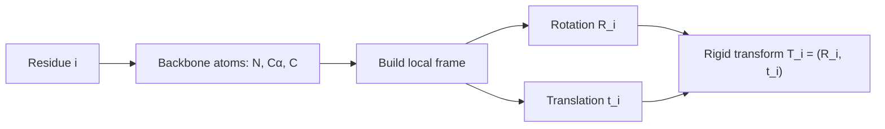
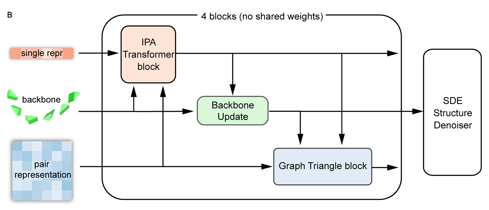
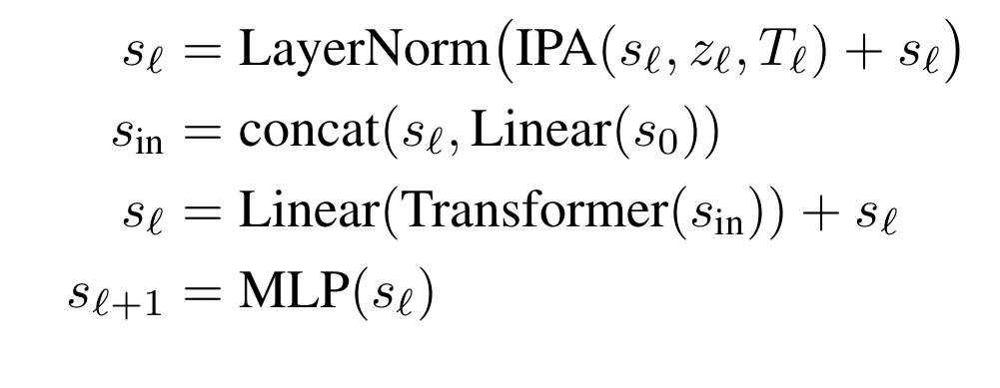
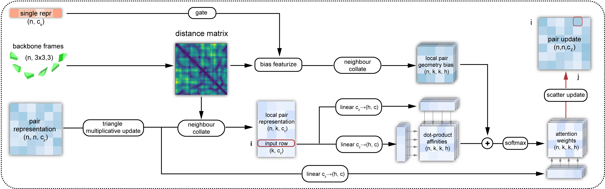
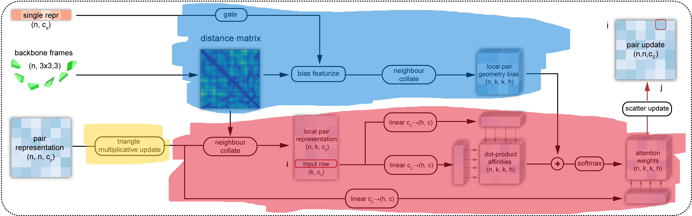

<!--
date: 2026-03-22
description: Read and analyze paper on protein structure generation. Building upon the advancements of AlphaFold2, the 2024 Nobel Prize in Chemistry.
subtitle: Paper about protein structure generation. Building upon the advancements of AlphaFold2, the 2024 Nobel Prize in Chemistry. Accepted in PMLR 2024.
tag: Reading
-->
# Proteus: Exploring Protein Structure Generation for Enhanced Designability and Efficiency
Since this is my first academic paper, I thought it would be easier to start with an article I've already researched and found quite impressive. Besides, I think that because I'll be encountering many international concepts, I'll use English in my academic writing.
{width=70%}
*Title page of the Proteus paper.*
## 1. Protein
### 1.1 What made protein ?
**Amino acids**

I'll start with this, amino acids. It is the building blocks of proteins (of course there's a lot of concept that smaller than this, but I think this level is enough to understand this paper). 

So what is the amino acids, for those who studied in Vietnam, you may know this concept from high school chemistry, specifically, it is the third or fourth lesson in the chemistry textbook for 12th grade. 

{width=65% position=right}
*The basic structure of amino acids. Cre: [ReAgentChemicals](https://www.reagent.co.uk/blog/what-are-amino-acids/)*

Amino acids are the molecules that contain both an amino group (-NH2) and a carboxyl group (-COOH). In the center of the molecule, there is a carbon atom called the alpha-carbon, which is bonded to the amino group, the carboxyl group, a hydrogen atom, and a side chain (R-group), that are making the different between amino acids.

We have 22 different amino acids, and they are making the different between proteins. Once again, if you are (or were) a Vietnamese student, you may remember the name GLY, ALA, or VAL, that is the abbreviation of amino acids. 
{width=60%}
*22 types of amino acids. Cre:[JPT](https://www.jpt.com/support-contact/resources/amino-acids/?srsltid=AfmBOop7xZYwPVHzS3WKGWbyR-3O0MFi922hlCleeX-WMBDGccPSVVNQ) *

**Protein**
From the basic concept of amino acids above, we continue to Protein, which basically is the chain of amino acids. 
{width=80% position=right}
*Protein is the chain of amino acids. Cre: [Technologynetwork](https://www.technologynetworks.com/applied-sciences/articles/essential-amino-acids-chart-abbreviations-and-structure-324357)*
Yeah, it is that simple. But the problem is that the protein is not just a straight chain of amino acids. It is a 3D structure that is folded in a specific way. So the next question is, how does the protein fold into a 3D structure?

**Protein folding**
The protein folding is the process by which a protein folds into its 3D structure. Present into 4 levels:
1. Primary structure: The sequence of amino acids.
2. Secondary structure: The local folding of the protein, such as alpha-helices and beta-sheets.
3. Tertiary structure: The overall 3D structure of the protein.
4. Quaternary structure: The structure of the protein when it is composed of multiple polypeptide chains.
{width=50%}
*Protein folding. Cre: [Linkedin](https://www.linkedin.com/pulse/why-protein-folding-big-deal-balasundararaman-sundar-/)*

### 1.2 CASP 
CASP(Critical Assessment of protein Structure Prediction) is an Sciencetific Internationnal Competition held every 2 years to evaluate methods for predicting the 3D structure of proteins from amino acid sequences.

Teams have to predict the structure of unpublished proteins, then compare it with real experimental results (X-ray, cryo-EM, etc.). 

{width=63% position=right}
*AlphaFold2's CASP14 breakthrough: global distance test accuracy rose sharply and crossed the rough experimental-quality regime.*
This competition is nothing special until 2018 (CASP 13) with the appearance of AplhaFold, the accuracy increase dramatically since this. 2 years later, AlphaFold2 was released in CASP 14 with the highest accuracy in the history, nearly two times higher than the former champion (AlphaFold) with the value of nearly 90%, which is considered as the experimental accuracy. This result is widely remarked that the protein folding problem was largely solved and the later CASP competitions focused on dealing with solving the complex systems instead of a single protein.

{width=60%}
*AlphaFold3 benchmark overview across ligands, nucleic acids, covalent modifications, and proteins.*

In recent years, CASP 15 with RoseTTAFold and AlphaFold2 updated or CASP 16 with the dominant of AlphaFold3 have increased a lot. But it seems to reach a limit in such a “post-AlphaFold era”. Now scientists are turning to another problem such that "Complex system" above is related to the aspects that AlphaFold not good at.

### 1.3 Some former model and its story
**AlphaFold series and AlphaFold2**

AlphaFold is the turning point of modern protein structure prediction. The first version (CASP13, 2018) showed that deep learning could strongly improve geometric prediction, and AlphaFold2 (CASP14, 2020) pushed performance close to experimental accuracy with end-to-end geometric modeling.

{width=60%}
*AlphaFold2 architecture* 

**AlphaFold first appearance**

At first appearance, AlphaFold mainly predicted geometric constraints (especially pairwise residue distances) and reconstructed 3D from them. It was a major breakthrough, but still pipeline-heavy. AlphaFold2 made the decisive jump by jointly refining sequence, pair, and 3D representations; this is the key reason later generation models (including Proteus) inherit many of its ideas.

**RoseTTAFold**
RoseTTAFold is used because its 3-track design (1D sequence, 2D pair, 3D structure) exchanges information effectively and gives strong structure reasoning.  
{width=60%}
*RoseTTAFold architecture*

The drawback in the Proteus paper context is that triangle-attention-heavy computation is expensive (\(O(N^3)\)) and is less direct in injecting backbone geometry at that stage. Proteus addresses this with local graph neighborhoods (\(O(NK^2)\)) and explicit structure bias.

## 2. Preliminaries
### 2.1 Protein backbone representation
To let a model understand a protein, we first need a representation that is stable under rotation and translation. If we only store the absolute coordinates of all atoms, then two identical proteins placed in two different positions in 3D space would look different to the model. That is inconvenient.

Rigid frames, as in AlphaFold2. Proteus follows the same idea: the backbone of each residue (each amino acid) is parameterized by a rigid transformation, also called a "frame". Each frame is written as \(T = (R, t)\).

Two notes that matter for the intuition:

1. Rigid means distance-preserving. \(T = (R, t)\) is a rigid transformation: it does not change distances (or angles) within the object being moved-only its position and orientation in space.
2. What the backbone atoms are. Each amino acid has an amino group (N) and a carboxyl group (C), with the alpha-carbon (Cα) sitting between them on the backbone. The local frame is built from these three backbone atoms (N, Cα, C), not from the whole side chain.

**What \(R\) and \(t\) mean in that local picture**

1. \(R\) (rotation matrix in \(SO(3)\)) encodes 3D rotations. It describes the relative orientation of the residue in its own (local) frame: you can think of it as rotating the axes so the residue is described in a consistent local geometry.
2. \(t\) (translation vector in \(\mathbb{R}^3\)) encodes translation. It describes the relative position of the residue-where the origin of that local frame sits in space (in standard constructions, the origin is tied to the Cα / frame construction rather than using raw atom triples alone as the only description).

**Why not only global \([N, Cα, C]\) coordinates?**

A protein has many residues at different absolute positions. Raw 3D coordinates of backbone atoms only give absolute placements; exploiting local geometric relationships across the chain is awkward if every residue is expressed only in a single global coordinate system. So each residue is embedded in its own 3D coordinate system (its frame): \(R\) rotates that system so the residue is represented in a sensible local pose (with Cα playing the role of the frame origin in the usual construction), and \(t\) places that frame in space.

Instead of describing the backbone only by listing atom coordinates in global 3D, the model uses a rigid transform per residue to describe the state of each amino acid. That is convenient when you want to update one residue’s pose independently during generation, instead of having to adjust the entire backbone in an unconstrained way.
{width=60%}
*From one global coordinate system to per-residue local frames along the backbone.*

One residue frame is written as:

$$
T_i = (R_i, t_i)
$$

If a point \(x\) is expressed in the local frame, the corresponding global point is:

$$
x_{\text{global}} = R_i x + t_i
$$

So in one sentence: each amino acid gets its own rigid frame; that makes local geometry and independent per-residue updates much more natural than using only absolute coordinates.

### 2.2 Diffusion modeling on protein backbone
The central idea of Proteus is to use the forward process of a diffusion model, but not to add noise to pixels. The same forward corruption and reverse denoising story applies to the protein backbone: translations and rotations of the frames are noised in diffusion time \(t\), and a network learns to invert that process.

{width=120% position=left}
*Forward diffusion corrupts structure; reverse diffusion denoises it back toward a protein backbone.*

Below: (1) the general forward representation in diffusion modeling-the SDE written explicitly, with each symbol explained; (2) the SDE for the protein backbone, i.e. the same template when the state is on \(SO(3) \times \mathbb{R}^3\) per residue.

### 2.3 General forward representation in diffusion modeling

A forward diffusion process maps a clean random variable \(Y_0\) to increasingly noisy \(Y_t\) as \(t\) increases. In continuous time, the canonical general forward SDE (Itô form) is:

$$
dY_t = f(Y_t, t)\,dt + g(Y_t, t)\,dW_t.
$$

What each part of this equation means:

1. \(t\) - Diffusion time (algorithmic time), not physical folding time. Larger \(t\) means more forward corruption; typically \(t \in [0, T]\) for some horizon \(T\).
2. \(Y_t\) - The state being noised at time \(t\) (for images: pixels; here: the tuple of all frame rotations and translations). The collection \(\{Y_t\}_{t \ge 0}\) is a stochastic process.
3. \(dY_t\) - The infinitesimal change of \(Y_t\) over an infinitesimal step of diffusion time (Itô calculus).
4. \(f(Y_t, t)\) - The drift coefficient: the deterministic part of the dynamics. If randomness were switched off (\(g \equiv 0\)), you would have \(dY = f(Y,t)\,dt\). Drift encodes systematic motion such as mean reversion or damping.
5. \(dt\) - An infinitesimal time step in diffusion time; it multiplies only the drift in this standard form.
6. \(g(Y_t, t)\) - The diffusion coefficient: how large the random kicks are at state \(Y_t\) and time \(t\) (noise scale / volatility).
7. \(W_t\) - A standard Wiener process (Brownian motion): continuous paths, independent Gaussian increments with mean zero and incremental variance proportional to \(dt\) in the usual formal sense.
8. \(dW_t\) - The Brownian increment on the interval of length \(dt\). The product \(g(Y_t,t)\,dW_t\) is the stochastic term; it injects randomness so trajectories diverge even from identical \(Y_0\).

In one sentence: drift \(f\,dt\) tells you the average, rule-based motion; diffusion \(g\,dW\) adds random spreading. Forward diffusion means choosing \(f\) and \(g\) so that \(Y_t\) becomes easy to sample from at large \(t\).

Simplest discrete forward form. In discrete time, the forward process is often written in one line as a noisy linear update from step \(t-1\) to step \(t\):

$$
x_t = \sqrt{\alpha_t}\, x_{t-1} + \sqrt{1 - \alpha_t}\, \epsilon, \qquad \epsilon \sim \mathcal{N}(0, I).
$$

Here \(x_t\) is the state at step \(t\) (what you noised). Meaning of each piece:

1. \(x_t\) - The state after the \(t\)-th corruption step.
2. \(x_{t-1}\) - The state one step earlier (slightly cleaner).
3. \(\alpha_t\) - A scalar in the noise schedule (usually in \((0,1)\)). It fixes how much of \(x_{t-1}\) is kept versus how much new noise enters at this step.
4. \(\sqrt{\alpha_t}\, x_{t-1}\) - Scales down the previous state. As the schedule is chosen so \(\alpha_t\) tends to shrink over the forward trajectory, this term weakens the signal from \(x_{t-1}\) and pushes the chain toward a simple (often nearly Gaussian) limit.
5. \(\sqrt{1 - \alpha_t}\, \epsilon\) - Fresh Gaussian noise injected at step \(t\); the factor \(\sqrt{1-\alpha_t}\) sets the noise strength at that step.
6. \(\epsilon \sim \mathcal{N}(0, I)\) - Standard normal noise: mean zero, identity covariance, so noise is isotropic across coordinates of \(x\).

Relation to the \(\beta_t\) notation. Many papers instead write the same Markov corruption as

$$
q(Y_t \mid Y_{t-1}) = \mathcal{N}\bigl(Y_t;\, \sqrt{1-\beta_t}\, Y_{t-1},\, \beta_t I\bigr),
$$

i.e. \(Y_t = \sqrt{1-\beta_t}\, Y_{t-1} + \sqrt{\beta_t}\, \varepsilon_t\) with \(\varepsilon_t \sim \mathcal{N}(0,I)\). That is the same update if you identify \(\alpha_t = 1 - \beta_t\) (keep fraction \(\alpha_t\), noise fraction \(1-\alpha_t = \beta_t\)). \(\beta_t\) is then the variance of the new noise at step \(t\). Under standard scalings, long chains of such steps converge to an SDE of the form \(dY_t = f\,dt + g\,dW_t\) above.

### 2.4 SDE of the protein backbone

Let residue \(i\) have rotation \(R_t^{(i)} \in SO(3)\) and translation \(X_t^{(i)} \in \mathbb{R}^3\) in the model's coordinates. The full backbone state is

$$
\mathcal{Y}_t = \bigl\{(R_t^{(i)}, X_t^{(i)})\bigr\}_{i=1}^{N}.
$$

The state space is not a single flat \(\mathbb{R}^d\): each residue lives in \(SO(3) \times \mathbb{R}^3\) (rotation \(\times\) translation), and the chain is the product over residues.

Compact forward SDE (block form). The forward motion on \(SO(3) \times \mathbb{R}^3\) can be written in one stroke for the backbone state at diffusion time \(t\). Let \(\mathbf{T}^{(t)}\) denote that state (rotations and translations stacked for the whole structure). To avoid confusion with section 2.1, \(\mathbf{T}^{(t)}\) here is not a single residue’s rigid map \(T_i=(R_i,t_i)\); it is the time-\(t\) argument of the diffusion. In bracket form:

$$
d\mathbf{T}^{(t)} = \left[ 0,\; -\frac{1}{2}\mathbf{X}^{(t)} \right] dt + \left[ d\mathbf{B}_{SO(3)}^{(t)},\; d\mathbf{B}_{\mathbb{R}^3}^{(t)} \right].
$$

Read this as two coupled blocks (rotation block first, translation block second):

1. \(\mathbf{T}^{(t)}\) - Protein backbone state at diffusion time \(t\).
2. Drift \(\left[ 0,\; -\frac{1}{2}\mathbf{X}^{(t)} \right] dt\):
   - First entry \(0\) - No drift on the rotational part of the forward process.
   - Second entry \(-\frac{1}{2}\mathbf{X}^{(t)}\) - \(\mathbf{X}^{(t)}\) is the position / translation component at time \(t\); the factor \(-\frac{1}{2}\) gives mean reversion toward the origin (the structure is pulled toward a center as diffusion time runs forward, while noise competes with that pull).
3. Noise \(\left[ d\mathbf{B}_{SO(3)}^{(t)},\; d\mathbf{B}_{\mathbb{R}^3}^{(t)} \right]\):
   - \(d\mathbf{B}_{\mathbb{R}^3}^{(t)}\) - Random translational increments in \(\mathbb{R}^3\) (isotropic across three axes).
   - \(d\mathbf{B}_{SO(3)}^{(t)}\) - Random rotational increments intrinsic to \(SO(3)\) (Brownian motion on the rotation group), not Euclidean noise pasted onto rotation matrices.

Backbone SDE in the same general form. Write the forward process on the backbone as

$$
d\mathcal{Y}_t = F(\mathcal{Y}_t, t)\,dt + G(\mathcal{Y}_t, t)\,d\mathbf{W}_t.
$$

Explanation specialized to the backbone:

- \(\mathcal{Y}_t\) - Entire backbone at diffusion time \(t\): all \(\{R_t^{(i)}, X_t^{(i)}\}\).
- \(F(\mathcal{Y}_t,t)\,dt\) - Drift on the product manifold. In the Proteus-style forward noising setup: no extra deterministic drift on the \(SO(3)\) factors (rotation is not systematically steered by a drift term in the forward process); translations carry a mean-reverting drift \(-\tfrac{1}{2} X_t^{(i)}\) so positions are pulled toward the origin and do not wander arbitrarily in \(\mathbb{R}^3\) before noise dominates.
- \(G(\mathcal{Y}_t,t)\,d\mathbf{W}_t\) - Noise, factored into two geometries:
  - \(dW_t^{(i)}\) in \(\mathbb{R}^3\) - standard Brownian motion driving the translational component \(X_t^{(i)}\) (random displacement in 3D).
  - Brownian motion on \(SO(3)\) driving \(R_t^{(i)}\) - random reorientation defined intrinsically on the rotation group (not by adding a matrix of Gaussian noise in \(\mathbb{R}^{3\times 3}\)).

Per-residue equations (explicit drift vs noise). For each residue \(i\),

$$
dX_t^{(i)} = -\frac{1}{2} X_t^{(i)}\, dt + g_{\mathbb{R}^3}(t)\, dW_t^{(i)}, \qquad dW_t^{(i)} \text{ standard BM in } \mathbb{R}^3.
$$

Here \(-\tfrac{1}{2} X_t^{(i)}\,dt\) is the drift on translation (pull toward \(0\)); \(g_{\mathbb{R}^3}(t)\, dW_t^{(i)}\) is translational noise. For the rotation,

$$
dR_t^{(i)} = R_t^{(i)} \circ dB_t^{(i),SO(3)}, \qquad \text{with zero deterministic drift on } SO(3),
$$

schematically: Brownian motion on \(SO(3)\) (noise in the Lie algebra \(\mathfrak{so}(3)\) coupled to \(R_t^{(i)}\)). Thus the protein backbone SDE is the template \(dY = f\,dt + g\,dW\) with \(f\) only on translations (mean reversion) and \(g\,dW\) supplying Euclidean noise for \(X\) and Riemannian noise for \(R\).

Translational marginal and score (\(\mathbb{R}^3\)). Conditioning on a clean \(\mathbf{x}^{(0)}\),

$$
p_{t \mid 0}\bigl(\mathbf{x}^{(t)} \mid \mathbf{x}^{(0)}\bigr) = \mathcal{N}\bigl(\mathbf{x}^{(t)};\, e^{-t/2}\mathbf{x}^{(0)},\, (1-e^{-t})\, I_3 \bigr).
$$

As \(t\) grows, \(\mathbf{x}^{(0)}\) matters less (mean weight \(e^{-t/2}\) decays) and isotropic noise grows in all three axes of \(\mathbb{R}^3\). The score used in denoising (derivative of \(\log p_{t \mid 0}\) w.r.t. the noisy translation) can be written as

$$
\nabla_{\mathbf{x}^{(t)}} \log p_{t \mid 0}\bigl(\mathbf{x}^{(t)} \mid \mathbf{x}^{(0)}\bigr) = (1 - e^{-t})^{-1} \bigl( e^{-t/2}\mathbf{x}^{(0)} - \mathbf{x}^{(t)} \bigr),
$$

equivalently \(\bigl(e^{-t/2}\mathbf{x}^{(0)} - \mathbf{x}^{(t)}\bigr) / (1 - e^{-t})\).

Rotational marginal and score (\(SO(3)\)). Let \(r^{(t)}, r^{(0)} \in SO(3)\) denote noisy and clean rotations. The transition density depends on the relative rotation \(r^{(0)\mathsf{T}} r^{(t)}\) through its rotation angle \(\omega(\cdot)\) (geodesic length on \(SO(3)\)):

$$
p_{t \mid 0}\bigl(r^{(t)} \mid r^{(0)}\bigr) = f\bigl(\omega(r^{(0)\mathsf{T}} r^{(t)}),\, t\bigr).
$$

Here \(f(\omega, t)\) is the heat kernel on \(SO(3)\) (Brownian motion on the group), written as an expansion in Wigner D-matrix / character modes indexed by \(\ell \in \mathbb{N}\):

$$
f(\omega, t) = \sum_{\ell \in \mathbb{N}} (2\ell + 1)\, e^{-\ell(\ell+1)t/2}\, \frac{\sin\bigl((\ell + \tfrac{1}{2})\omega\bigr)}{\sin(\omega/2)}.
$$

The exponent \(-\ell(\ell+1)t/2\) is the familiar angular Laplacian eigenvalue decay on \(SO(3)\); larger \(\ell\) encodes finer angular detail in the kernel. At \(\omega \to 0\), treat the fraction by its limit so the expression stays finite (standard for this kernel). The score on \(SO(3)\) is again the gradient of \(\log p_{t \mid 0}\), but in tangent (Lie algebra) directions on the group, paralleling the translation formula above.

One explicit way to write the rotational score function is:

$$
\nabla \log p_{t \mid 0}\bigl(r^{(t)} \mid r^{(0)}\bigr)
= \frac{r^{(t)}}{\omega(t)}\, \log\!\bigl(r^{(0)\mathsf{T}} r^{(t)}\bigr)\, \frac{\partial_{\omega} f(\omega(t), t)}{f(\omega(t), t)}.
$$

Here \(\omega(t) := \omega\!\bigl(r^{(0)\mathsf{T}} r^{(t)}\bigr)\) is the rotation angle (geodesic distance), and \(\log(\cdot)\) denotes the matrix log / log map from \(SO(3)\) to its Lie algebra \(\mathfrak{so}(3)\). Conceptually, \(\partial_{\omega} f / f = \partial_{\omega} \log f\) provides the “radial” part of the score along the geodesic, while the \(\log(r^{(0)\mathsf{T}} r^{(t)})\) term provides its direction in the tangent space.

Training and sampling. Exact scores on \(SO(3)\) can be heavy, so training learns an approximate score network \(s_\theta(\mathcal{Y}_t, t)\) via denoising score matching; generation runs a reverse-time discretization (e.g. Euler-Maruyama).

Goal. Recover the clean backbone \(\mathcal{Y}_0\) from any forward time \(t\); same objective as image diffusion, with state space \(\prod_i \bigl(SO(3)\times\mathbb{R}^3\bigr)\) instead of a pixel vector in \(\mathbb{R}^d\). Notation: diffusion time stays \(t\) (and \(\mathbf{T}^{(t)}\) above); folding-block depth uses \(\ell\) and backbone frames \(T^\ell\) in §2.3.

## 3 Model architecture 

This is the section where I leaned on my own figures the most, not only the paper’s Figure 2. I’ll stay consistent with Section 2.2: there diffusion time is \(t\) and the whole noisy backbone is \(\mathbf{T}^{(t)}\). Here \(\ell\) is the folding-block layer: \(T^\ell\) is the stack of per-residue frames after layer \(\ell\) (same rigid-frame idea as Section 2.1). I write \(s^\ell\) for the single (node) embedding and \(z^\ell\) for the pair / edge tensor.

Yeah, the high-level story is simple. Proteus runs \(L\) folding blocks one after another, and the blocks do not share weights-each has its own parameters.

Inside one block you always have three tracks going in: single, pair, and backbone frames. The block always does the same three steps in order:

1. IPA-Transformer - refreshes \(s\).
2. Backbone update - moves the frames forward.
3. Graph triangle block - refreshes \(z\) (the pair grid).

Every step looks at the other tracks, but only one track is “owned” by that step. The authors say openly that the graph triangle block is what really buys designability and efficiency (“Our primary emphasis is on elucidating the graph triangle block…”).

{width=65%}
*Overall architecture sketch: \(L\) folding blocks (no weight sharing), each with IPA-Transformer \(\rightarrow\) backbone update \(\rightarrow\) graph triangle block, followed by the SDE structure denoiser.*

### 3.1 IPA-Transformer block

Inputs: single representation \(s_\ell\), pair representation \(z_\ell\), current per-residue frames \(T^\ell\), and the initial singles \(s_0\) (for the skip-style path into the Transformer). Outputs: updated singles \(s_{\ell+1}\) only; \(z_\ell\) and \(T^\ell\) are unchanged until the later submodules run.

So this first step is exactly the Invariant Point Attention (IPA) story from AlphaFold2, plus a normal Transformer on top (that is how Wang et al. describe it).

IPA is the part that respects 3D. You don’t want attention logits to change just because you rotate or translate the whole protein in space for no reason. Roughly: each residue builds Q, K, V in its local frame, maps those into a global frame fixed by the current backbone, mixes information, then maps back so the update still “knows” geometry. After that, the Transformer path does the usual self-attention + FFN on the single chain, but with a small twist from the paper: they concatenate the current \(s_\ell\) with a linear projection of the initial \(s_0\) before the Transformer, so the block does not forget where the sequence started.

The block I saved as equations is just the same thing in math form: IPA residual + layer norm, concat with \(s_0\), Transformer + linear residual, then an MLP that outputs \(s_{\ell+1}\).

{width=55%}
*How I wrote the IPA-Transformer block: IPA on \((s_\ell, z_\ell, T_\ell)\), then concat with \(\mathrm{Linear}(s_0)\), Transformer, and MLP to \(s_{\ell+1}\).*

### 3.2 Backbone update layer

Inputs: singles \(s_{\ell+1}\) right after the IPA-Transformer, and the current frames \(T^\ell = \{(R_i^\ell, \mathbf{t}_i^\ell)\}_{i=1}^N\) per residue \(i\). Outputs: updated frames \(T^{\ell+1}\) in the same rigid-frame format; \(s_{\ell+1}\) and \(z_\ell\) are unchanged here.

Once \(s\) has moved, the frames should move too-backbone shape is really about how residues talk to each other, not a separate magic tensor.

What the equations are for. The network must turn a per-residue vector \(s_{\ell+1,i}\) into a small rigid motion that can actually be composed with the current pose: a rotation in \(SO(3)\) and a translation in \(\mathbb{R}^3\). The AlphaFold2-style recipe predicts a raw quaternion tail \((b_i,c_i,d_i)\) with the first component fixed to 1, predicts a translation increment \(\Delta\mathbf{t}_i\), then builds a valid rotation matrix from a normalized quaternion so every update stays a legal Euclidean motion.

{width=90% position=right}
*Backbone update: linear → unit quaternion → rotation matrix → compose with \(T^\ell\) to get \(T^{\ell+1}\).*

Why that form is necessary. (1) Unconstrained \(3\times 3\) matrices from a linear layer are not guaranteed orthogonal or det = +1; quaternion normalization plus the standard quaternion-to-\(SO(3)\) map is a cheap way to guarantee \(R_i^{\mathrm{upd}}\in SO(3)\). (2) Keeping the head at 1 trims one degree of freedom so the downstream map from \(\mathbb{R}^3\) to \(S^3\) is well posed before normalization. (3) Composition \(T_i^{\ell+1} = T_i^{\mathrm{upd}} \circ T_i^\ell\) matches “update the frame in place” during diffusion: you are not solving for the whole chain in one shot-you are applying a learned local rigid transform each time.

How you “solve” them. There is no inner optimization loop here; it is a forward pass of closed-form operations. Write \(\tilde{q}_i = (1, b_i, c_i, d_i)\), \(\hat{q}_i = \tilde{q}_i / \|\tilde{q}_i\|\), convert \(\hat{q}_i\) to \(R_i^{\mathrm{upd}}\) with the usual quaternion-matrix formulas, then compose

$$
R_i^{\ell+1} = R_i^{\mathrm{upd}}\, R_i^\ell,
\qquad
\mathbf{t}_i^{\ell+1} = R_i^{\mathrm{upd}}\, \mathbf{t}_i^\ell + \Delta\mathbf{t}_i
$$

(for the right-multiply convention used in many structure networks; the paper’s slide “equations (1)-(5)” pins down sign/order exactly). Backpropagation differentiates through normalization and the quaternion map automatically-the “solution” at inference is just evaluating this recipe once per block.

### 3.3 Graph triangle block

{width=70%}
*Internal dataflow of the graph triangle block: triangle multiplicative update, geometry-bias branch, local attention, and scatter-back to the pair map.*

**Input**

The graph triangle block takes three things:

1. the updated single representation \(s^{\ell+1}\) from the IPA-Transformer,
2. the updated backbone frames \(T^{\ell+1}\) from the backbone update layer,
3. the current pair representation \(z^\ell\).

**Output**

Its output is the updated pair representation \(z^{\ell+1}\). In other words, this block owns the pair track: singles and frames are used as context, but the object being refreshed here is the edge / pair tensor.

This is the most distinctive part of Proteus. The paper says explicitly that the graph triangle block is the main source of the model's gains in designability and efficiency. The reason is simple: protein structure is not only about single residues, but also about how residue pairs are arranged relative to a third residue in space. That is a triangle relation, not just a pairwise relation.

Two problems motivate the redesign:

1. dense triangle attention over all residue pairs is expensive, with cost scaling like \(O(N^3)\),
2. the pair pathway needs explicit, up-to-date geometric information from the current backbone, not only abstract pair features.

The note in your image organizes Proteus's answer into three parts: **(A)** sparse triangle attention on the edge representation with complexity \(O(NK^2)\), **(B)** a geometry-aware bias built from the **third edge** of the triangle, and **(C)** a **triangle multiplicative update** applied **before** attention. That "(C) first, then attention" ordering is important in the Proteus block.

**Evoformer architecture**

{width=60% position=left}
*Evoformer pair track in AlphaFold2: triangle reasoning is central, and Proteus borrows that idea rather than discarding it.*
Proteus inherits its basic triangle intuition from Evoformer in AlphaFold2. In Evoformer, pair features are not updated as isolated edges; edge \((i,j)\) can be influenced by a third residue \(k\), so the triangle \((i,k,j)\) helps refine the relation between \(i\) and \(j\). That idea is very powerful, but the dense AlphaFold2 version is too expensive for a generative backbone model that must run repeatedly during diffusion.

So Proteus keeps the triangle logic, but replaces the dense all-pairs implementation with a graph-based local version. It also injects backbone geometry directly into the attention bias, which is exactly what matters in structure generation.

{width=70%}
*My colored summary of the graph triangle block: yellow = triangle multiplicative update, blue = geometry / bias branch, red = sparse local triangle attention and scatter-back.*

**Explanation of 3 core block**

I want to describe the colored diagram in a way that makes both the color coding and the actual dataflow clear.

**1. Yellow module: triangle multiplicative update**
::: notes [left] Triangle multiplicative update
{width=100%}
*Left: multiplicative update using **outgoing** edges \(ik\) and \(jk\) to refine target edge \(ij\). Right: update using **incoming** edges \(ki\) and \(kj\) to refine \(ij\).*

From AlphaFold2 / Evoformer: each edge in a triangle is updated from the **other two edges**. This submodule is **only** a multiplicative update, not attention, so there is **no softmax** here.

Two views for the same target edge \(ij\):

1. **Outgoing:** use \(ik\) and \(jk\).
2. **Incoming:** use \(ki\) and \(kj\).
:::
This is the first step applied to the pair representation, before any local attention happens. The input here is still the global pair map \(z^\ell\). Proteus borrows this idea from Evoformer: for a target edge \((i,j)\), the update is not computed from that edge alone, but from triangular interactions involving a third residue \(k\). In practice, the model combines information from the other two edges of the triangle-for example the **outgoing** pair \((ik, jk)\) or the **incoming** pair \((ki, kj)\)-so edge \((i,j)\) receives a higher-order structural message.

The important point is that this stage is a multiplicative update, not an attention step. There is no softmax here. The model uses pair-pair interactions to refresh the full edge representation before sparsifying into local neighborhoods. This is exactly the **(C)** part of the block: **before triangle attention is performed, Proteus first updates the whole initial edge representation**. One practical motivation for keeping this kind of update is that it helps backbone-diffusion modeling, is lighter in memory than relying only on attention, and works well as part of a broader geometric architecture.

**2. Blue module: geometry bias branch**
::: notes [right] Geometry bias
The blue branch uses the **third edge** distance in the triangle, maps it with **RBF** features, and turns it into a structural bias. A **gate** then controls how strongly that bias affects the pair update.
:::
This branch is what makes the block truly geometric for diffusion. Proteus uses the updated backbone frames \(T^{\ell+1}\) to compute structural distances, rather than relying only on abstract pair embeddings. A key idea here is that the model uses the distance of the **third edge** in the triangle. Those distances are then mapped into **RBF**-style features, which become a structural bias for the later attention logits.

There are several smaller steps inside this blue region. First, the block computes a distance matrix from the current backbone. Then it runs bias featurization to transform raw distances into a richer structural encoding. After that, neighbor information is collated so each residue only carries its \(K\) nearest spatial neighbors. The result is a **local pair geometry bias** tensor, aligned with the local pair representation that will be used in attention.

Another key detail is the **gate**. The structural bias is controlled by a **1-layer feedforward network**. Operationally, that gate is driven by the single representation \(s^{\ell+1}\), so the model can control how strongly geometric bias should affect the pair update and how it should mix with the other two tracks. In other words, geometry is not injected blindly. The single track can amplify, soften, or filter the structural bias depending on context.

**3. Red module: sparse local triangle attention**
::: notes [right] Triangle attention
{width=100%}
*Left: triangle self-attention **around the starting node** \(i\) (edges from \(i\) interact when updating \(ij\)). Right: **around the ending node** \(j\) (edges into \(j\) interact when updating \(ij\)).*

Triangle attention is attention over a **triangle** \((i,j,k)\), not an isolated pair. The model considers triangles, runs attention, then writes the result back to the **pair** representation.

For edge \(ij\), there are two common views:

1. **Around the starting node** \(i\).
2. **Around the ending node** \(j\).

The grey **third edge** is where structural **logit bias** is usually injected.
:::
This is the attention-heavy part, and Proteus makes it local on purpose. This is the **(A)** part of the design. Instead of running triangle attention over the full \(N^2\) edge set, the block first selects only \(K\) nearest neighbors for each residue using C\(\alpha\) distance. That means attention is only computed on the \(N \cdot K\) local edge family, reducing the expensive part to roughly \(O(NK^2)\) instead of \(O(N^3)\). The reason this scales like \(NK^2\) is that for each of the \(N\) residues, the model considers \(K\) nearby neighbors and performs triangle-style interactions inside that \(K\)-sized local set.

Inside this red region, the pipeline is more detailed than my earlier version. The block first builds a **local pair representation** for the chosen neighbors. Then linear layers project that local pair tensor into features used by attention. Dot-product affinities are computed between local edge features, and the blue-branch structural bias is added into those logits. After that, softmax produces attention weights, those weights are used to compute the **pair update**, and finally a **scatter update** writes the local results back into the global pair map.

That last scatter step matters. Even though attention is computed locally, the model still needs to return a global pair tensor \(z^{\ell+1}\). So the local neighborhoods are only the computation space; the output is still a global edge representation for the next folding block.

If we follow the dataflow in order, it is:

$$
(s^{\ell+1}, T^{\ell+1}, z^\ell)
\rightarrow \text{triangle multiplicative update}
\rightarrow \text{distance / bias / gate branch}
\rightarrow \text{local triangle attention}
\rightarrow z^{\ell+1}.
$$

Written as a single pipeline, the block is: **triangle multiplicative update \(\rightarrow\) neighbour collate \(\rightarrow\) local pair representation \(\rightarrow\) distance matrix and bias featurize \(\rightarrow\) local pair geometry bias \(\rightarrow\) gate \(\rightarrow\) attention mechanism \(\rightarrow\) pair update \(\rightarrow\) scatter update**.

**Final explain**

From the explanations above, I would rewrite this block in a compact step-by-step style.

Input of the block:

- single representation updated by the IPA-Transformer block,
- backbone representation updated by the backbone update layer,
- pair representation from the previous pair track.

The submodules inside the block are:

- **Triangle multiplicative update:** the initial pair representation is updated by combining information from triangle relationships between residues.
- **Neighbour collate:** for each residue, the model selects the \(K\) nearest residues according to spatial distance.
- **Local pair representation:** the model builds pair features for those local neighboring residue pairs.
- **Distance matrix and bias featurize:** distances from the current backbone are converted into structural bias features.
- **Local pair geometry bias:** the structural bias is aligned and fused with the local pair representation.
- **Gate:** the single representation controls how strongly the structural bias should contribute.
- **Attention mechanism:** local edge features are passed through linear layers, dot-product affinities are computed, geometric bias is added, softmax produces attention weights, and those weights generate the local pair update.
- **Pair update:** the pair representation is updated from the local attention result.
- **Scatter update:** all local pair updates are merged back into the final global pair representation.

So if I explain it in one sentence, this block takes updated single features, updated backbone geometry, and old pair features, then uses triangle multiplicative update plus geometry-aware local triangle attention to produce a new pair representation \(z^{\ell+1}\).

## 4 Training and evaluation

### 4.1 Overall procedure (sampling / inference)

{width=90% position=left}

Generation is still a diffusion story, but the noise is geometric: you perturb both where each residue sits and how it is oriented (random translations in \(\mathbb{R}^3\) and random rotations per residue), not raw image pixels. The model is trained end-to-end; at inference you only run the reverse process, discretized with an Euler-Maruyama-style SDE step on the product of \(SE(3)\) factors, using the score parametrization from Section 2.2.

In words that match Algorithm 1 and the same structure as Section 2.3: start at diffusion time \(t = 1\) with a fully noisy backbone. At that point each residue gets a random translation and a random rotation, packed into rigid transforms \(T_i^{(t)}\), with a “previous structure” cache initialized to identity transforms. Each outer step then builds the features needed by the network, runs the folding stack, and uses an \(SE(3)\) reverse-diffusion update to move the noisy backbone toward the model’s current prediction. Concretely, after initialization the model embeds the timestep into single and pair features (`InputEmbedder`), adds conditioning from the previous predicted backbone (`ConditionEmbedder`), then runs the folding stack for \(N_{\text{layer}}\) blocks: IPA-Transformer on \((s, z, \hat{T}^{(0)})\), backbone update on \(\hat{T}^{(0)}\), then the graph triangle module on \(z\). The network’s current estimate \(\hat{T}^{(0)}\) becomes \(T^{\text{prev}}\) for the next diffusion step; \(t\) is decremented and an \(SE(3)\) SDE solver updates the noisy state \(T^{(t)}\) toward that prediction, with default settings such as \(N_{\text{step}} = 100\), \(N_{\text{layer}} = 4\), \(t_{\min} = 0.005\), and a small noise scale for the discretization.

The **node / pair init** step can also be stated more explicitly. For the **node representation**, the input is the diffusion time \(t\) together with a one-hot residue-type feature; in the unconditional backbone-generation setup, that residue type is fixed to alanine. Those features are concatenated and passed through an MLP to produce the initial node embedding. For the **pair / edge representation**, the model combines the two endpoint node embeddings with a relative sequence-position encoding in the AlphaFold style. So the initialization already carries both “where in diffusion are we?” and “which residues / sequence positions are interacting?” before any folding block runs.

Finally, the reverse process is solved by **Euler-Maruyama discretization** using the score functions described earlier. So the sampling story is: initialize a fully noisy backbone, build node / pair features, run the folding blocks, estimate the clean structure at the current step, and use an Euler-Maruyama reverse update to continue denoising.

### 4.2 Data and training objective

Training uses structures from the [Protein Data Bank](https://www.rcsb.org/) with a cutoff of 1 August 2023, plus additional data augmentation. In total the authors report 50,773 protein chains in the training set.

The total objective is the sum of a denoising score-matching block on translations and rotations plus light auxiliary terms on coordinates and the distance matrix, active only once the noise is low enough (\(t < 0.25\)):

$$
\mathcal{L} = \underbrace{\mathcal{L}_{\text{trans}} + 0.5\mathcal{L}_{\text{rot}}}_{\text{dsm loss}} + \underbrace{0.25\mathcal{L}_{\text{coord}}^{t<0.25} + 0.25\mathcal{L}_{\text{dm}}^{t<0.25}}_{\text{auxiliary loss}} \quad (3)
$$

When \(t\) is still large, the backbone is too corrupted for atomic coordinates or pairwise distances to be meaningful supervision; after \(t\) drops below \(0.25\), those terms help lock in fine-grained geometry. Denoising score matching remains the main signal: it pushes the learned score to match the true score of the noised process for both translation and rotation.

### 4.3 Benchmarks (designability, speed, diversity)

The paper evaluates monomer generation against RFdiffusion, Genie (SwissProt), FrameDiff, and Chroma. One compact summary table (same metrics as the paper’s main comparison):

{width=45%}

Reading that snapshot in plain language: Proteus reaches the highest designability score (0.921) and the fastest per-sample wall time (18.20 s in the reported setup) while using 100 timesteps; diversity is second-best (0.235) behind RFdiffusion (0.328). RFdiffusion carries the most parameters (59.8M) and is much slower (120.24 s); Genie is smallest (4.1M) but slowest here (188.07 s) and needs many steps (1000); Chroma is almost as fast as Proteus in seconds but lags sharply on designability and diversity; FrameDiff sits in the middle on several axes.

Figure below combines several views: a radar chart on designability (sc_TM-score), throughput (samples per minute), and diversity; box plots of scRMSD versus length (200 backbones per length; horizontal reference near 2 Å; ProteinMPNN with 8 sequences per backbone except Chroma’s own designer); and inference time versus length on an A40, with Proteus staying nearly flat while others grow steeply (Genie stops after 600 residues because of memory limits).

{width=70%}

On protein complexes (dimers, trimers, tetramers), Proteus is compared especially to Chroma; the paper reports favorable complex performance there as well.

### 4.4 Interpretive view on structural levels

For **secondary-structure-like organization** (alpha-helices, beta-sheets, local backbone arrangement), the main role naturally falls to the **IPA-Transformer** plus the **backbone update layer**. IPA lets residues exchange geometry-aware information, while the backbone update converts that refined residue representation into actual changes in frame orientation and position. Together, those two stages are the most natural place for learning local folding patterns and short-range spatial organization.

For **tertiary structure**, the **graph triangle block** is especially important, especially the **structure bias** and **triangle multiplicative update**. The structure bias injects real geometric constraints from distances in 3D space, which helps the model avoid geometrically implausible folds. The triangle multiplicative update helps model three-body / triangular interactions among nearby amino-acid groups, which is exactly the kind of relation that matters once you move beyond local secondary motifs and need a coherent global fold.

For **quaternary structure** in complexes, **chain positional encoding** and **local graph modeling** are the key ideas. Chain positional encoding is part of feature initialization: different polypeptide chains receive distinct positional offsets so the model can tell which residues belong to which chain. Local graph modeling, meanwhile, helps the model organize inter-chain contacts through appropriate local neighborhoods in the graph triangle machinery. That combination is a natural explanation for how Proteus can extend from single-chain backbones to complexes while preserving plausible interfaces.

### 4.5 In vitro validation (draft)

The paper reports wet-lab checks so designability scores are not only in silico. For now, this scaffold tracks what belongs here:

- **Designs versus controls** - which Proteus-generated sequences (and any baselines) went to expression; what length / fold family / oligomer state.
- **Expression and readout** - host, induction, solubility / pellet vs supernatant, and whether folding was assessed by CD, SEC, NMR, activity, or structural methods.
- **Outcome vs computation** - which designs behaved as folded or functional proteins, and how that lines up with **sc_TM** / **scRMSD** from the paper’s screens.

*Placeholder one-liner from the paper (to be replaced with detail):* designed proteins from Proteus were expressed and reported to fold consistently with intent, complementing the in silico designability tables.

## 5. Final thoughts
What I like about Proteus is that it sits in a very interesting place in the post-AlphaFold era.

AlphaFold2 more or less changed the question from "can we predict a structure?" to "what else can we do with structural intelligence?" Proteus is a nice example of this shift. Instead of focusing only on prediction, it moves toward generation, designability, and efficiency.

For me, the most memorable points of the paper are:

1. representing each residue as a rigid frame,
2. running diffusion on the combined rotation-and-translation space \(SO(3)\times\mathbb{R}^3\),
3. using a graph triangle block to keep the model both geometric and efficient.

I think this paper is also a good bridge paper for beginners. It connects ideas from biology, geometry, stochastic processes, and deep learning architecture in a way that is hard at first, but very rewarding once the big picture becomes clear.

If I continue this topic in another post, I would probably write more carefully about three things: the exact definition of the rotational score on \(SO(3)\), the difference between Proteus and RFdiffusion in practice, and why designability is a better target than visual quality alone.
